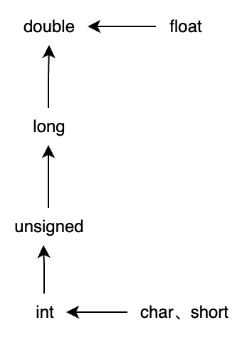

- [第一个C程序](#第一个c程序)
  - [代码示例](#代码示例)
  - [程序结构](#程序结构)
- [数据的表示形式](#数据的表示形式)
  - [常量和变量](#常量和变量)
    - [常量](#常量)
    - [变量](#变量)
      - [作用域](#作用域)
      - [生存期](#生存期)
    - [标识符](#标识符)
  - [数据类型](#数据类型)
  - [数据类型转换](#数据类型转换)
  - [输入输出函数](#输入输出函数)
- [数据的存储类别](#数据的存储类别)
  - [局部变量的存储类别](#局部变量的存储类别)
  - [全局变量的存储类别](#全局变量的存储类别)
- [运算符](#运算符)
- [数组](#数组)
  - [定义数组](#定义数组)
  - [初始化](#初始化)
  - [定义和初始化二维数组](#定义和初始化二维数组)
  - [字符数组及初始化](#字符数组及初始化)
- [字符串](#字符串)
  - [字符串处理函数](#字符串处理函数)
- [函数](#函数)
  - [函数定义](#函数定义)
  - [函数调用](#函数调用)
  - [函数的参数](#函数的参数)
    - [数组作为参数](#数组作为参数)
  - [内部函数](#内部函数)
  - [外部函数](#外部函数)
  - [main 函数](#main-函数)
  - [exit 函数](#exit-函数)
- [指针](#指针)
  - [指针变量](#指针变量)
  - [通过指针引用数组](#通过指针引用数组)
    - [指针指向数组元素时的运算](#指针指向数组元素时的运算)
    - [数组名为函数参数](#数组名为函数参数)
    - [指针指向二维数组](#指针指向二维数组)
  - [通过指针引用字符串](#通过指针引用字符串)
  - [指向函数的指针](#指向函数的指针)
  - [指针数组](#指针数组)
  - [void 指针](#void-指针)
  - [指向指针的指针](#指向指针的指针)
  - [动态内存分配](#动态内存分配)
- [自定义数据类型](#自定义数据类型)
  - [声明结构体类型](#声明结构体类型)
  - [结构体类型变量](#结构体类型变量)
  - [结构体数组](#结构体数组)
  - [结构体指针](#结构体指针)
  - [共用体类型](#共用体类型)
  - [枚举类型](#枚举类型)
  - [typedef 新类型](#typedef-新类型)
- [文件](#文件)
  - [文件的操作](#文件的操作)
    - [打开关闭文件](#打开关闭文件)
    - [读写文件](#读写文件)
      - [顺序读写](#顺序读写)
      - [随机读写](#随机读写)
- [预编译处理](#预编译处理)
  - [宏](#宏)
  - [文件包含](#文件包含)
  - [条件编译](#条件编译)

# 第一个C程序
## 代码示例
```C
#include <stdio.h> // standard input & output .h为头文件
int a, b; // 全局声明
int main(void) { // main函数只能有一个，必须包含。 void可省略
    int a, b;
    int fun(int a);// 声明函数
    // %d为十进制整数形式  &为地址符    %lf 双精度实数
    scanf("%d, %d", &a, &b);
    // %d   %3.2f 输出3位数，其中2位小数
    printf("a = %d, b = %d", a, b);
    return 0; // main函数返回值一般为0
}
int fun(int a) {
    int res;
    // 逻辑
    return res;
}
```
## 程序结构
1. 源程序文件
一个程序由一个或多个源程序文件组成。
    -  预处理指令
    `#include <stdio.h>`
    预处理器对指令进行预处理(读取头文件内容，和其他程序一起组成可编译的源程序)，编译器对源程序进行编译==>目标程序
         > 不是C语言的一部分，由编译器提供的，包括`#define N 1`；
         预处理功能主要包括宏处理、文件包含处理、条件编译处理。
    - 全局声明
    - 函数定义
2. 函数是C程序的主要组成部分
函数是C程序的基本单位。
无参函数：`int fun();` <==> `int fun(void);`
3. 一个函数包含两个部分
    - 函数首部
    函数类型 函数名(参数类型 参数名)
    - 函数体
    包含声明部分(变量和方法)和执行部分(0个或多个语句)
4. 程序总是从main函数开始执行
5. 程序中计算机完成的操作是由函数中的C语句完成的
6. 在声明和语句最后必须有分号
7. C语言本身不提供输入输出语句
是由库函数scanf和printf实现。
8. 注释
> 程序 = 算法 + 数据结构

# 数据的表示形式
## 常量和变量
### 常量
注意字符常量和字符串常量，字符常量`'a'`，字符串常量`"ab"`。
符号常量：`define PI 3.1415926`
> 符号常量不占内存，是一个临时符号，预编译后符号常量全部被换为了字面常量，这个符号就不存在了，所以不能对符号常量赋予新值

### 变量 
必须**先定义后使用**
`类型 变量名 = 变量值;` 变量名代表存储地址
- 常变量：`const 类型 名 = 值;` 变量存在期间其值不能改变
> 建立存储空间的声明称为定义(定义性声明)，不建立存储空间的声明称为声明，如 `int a`-> 定义，`extern a`-> 声明。
#### 作用域
变量又被分为全局变量和局部变量
- 全局变量在函数外部定义，第一个字母通常大写，在开始定义到源文件结束内有效
- 局部变量在函数内部定义
- 全局变量要少用，尽量不用。程序执行的过程中存储单元一直占用；函数的通用性降低了，执行期间文件引入要考虑全局变量的影响；全局变量过多，会降低程序的清晰性，全局变量的值较难判断

#### 生存期
变量的生存期也为变量值存在的时间，即变量的存储
   - 静态存储方式
   程序在运行期间由系统分配固定的存储空间，而不是动态的分配和释放，程序执行完毕后释放。如全局变量。
   - 动态存储方式
   程序在运行期间根据需要进行动态分配存储空间，函数开始调用期间动态分配存储空间，结束释放空间。如形参、自动变量(局部变量)、函数调用时的现场保护和返回地址等。
### 标识符
数字、字母、下划线组成，第一位必须为字母或下划线

## 数据类型
1. 基本类型
整型：int、short int、long int(long型)、long long int(双长整型)、char、bool
浮点：float、double、复数浮点型
2. 枚举类型
3. 空类型
4. 派生类型
指针类型、数组类型、结构体类型、共用体类型、函数类型
## 数据类型转换
计算机指令只能对相同类型的数据进行计算，得到同一类型的结果。
转换方式：
1. 隐式转换
   - 自动类型转换
  基本原则: 字节数少的类型往字节数多的类型转(类型提升)；
  浮点类型转换规则: float-> double-> long double；
  整数类型转换规则: int-> unsigned int-> long int-> unsigned long int。
  

   - 赋值类型转换
  基本规则: 编译器将右侧表达式的值自动转换为左侧变量的类型；
  赋值类型转换与参数类型转换相同。
2. 显式转换
   - 强制类型转换
  可能造成类型转换问题，如精度丢失、位扩展问题。
转换存在的问题：
1. 精度丢失
   实数-> 整数、double-> float、long-> float

类型所占字节数(不一定)：
|||
|-|-|
|char|1|
|short|2|
|int|4|
|unsigned int|4|
|float|4|
|double|8|
|long double|8|
|long int|8|
|unsigned long int|8|


## 输入输出函数
> 并不是C语言提供的，而是使用了函数库

|||
|-|-|
|%d|整数|
|%c|字符|
|%s|字符串|
|%f|小数(%m.nf 一共m位，小数有n位) (%-m.nf 数据靠左输出) lf双精度|
|%e|指数|
|%lu|无符号长整数 可以输出 `sizeof` 结果
|||
> **域宽**
输出指定列数，实际输出列数较少时，左部有空余位
1. `printf(格式控制, 变量列表)`
2. `scanf(格式控制, 地址列表)`
   > 地址列表为地址符，而不是变量名
   `scanf("a = %d, b = %d", &a, &b);` 输入时应为：a = 2, b = 1
3. `putchar(c)`
只能输出一个字符
1. `getchar()`
只能输入一个字符
> 输入信息后存入缓存，按“Enter”后才输入赋值给变量
# 数据的存储类别
> 变量和函数的两个属性：数据类型和数据的存储类别(存储类别也为数据在内存中的存储方式)。
> 存储类别有：auto、static、register和extern四种。
## 局部变量的存储类别
1. 自动变量 auto
   动态存储区；
   函数中的局部变量，非 static 类别。函数调用时动态的分配内存空间，调用结束就释放内存。如 `auto int a = 10;` ，`auto` 通常被省略，被隐式指定为自动变量，上述与 `int a = 10;` 等价；
   在函数调用时赋初值，每次调用就赋值一次，值不确定(每次重新分配内存)。
2. 静态局部变量 static
   静态存储区；
   函数调用结束后，其中用 `static` 修饰的变量占用的存储单元不被释放，保留当前值，当下次调用该函数时此变量有值(长期占用内存，程序的可读性较差)；
   在编译时赋初值(0、'\0')，且只赋值一次;
3. 寄存器变量 register
   CPU中的寄存器；
   寄存器中的存取速度高于内存；对于一些使用频繁的局部变量，将变量值直接存入寄存器中，需要时再从寄存器中读取，如 `register int a;`；（了解）
> static、auto 和 register不能单独使用，必须在定义变量时使用。
## 全局变量的存储类别
存放在**静态存储区**中，存在于程序运行的整个过程中。一般来说，作用域是在变量开始定义处到程序末端，作用范围有如下 种情况：
1. 在一个文件内扩展外部变量
在定义处之前的函数可以引用该外部变量，`extern` 关键字对该变量做外部变量声明，从声明处开始，可以使用外部变量，如 `extern int a;`。
在声明外部变量时，可以不指定类型，如 `extern a;` 。
2. 将外部变量扩展到其他文件
在一个文件中定义外部变量，并在另一个文件中 `extern` 对变量作外部声明，即 `extern 变量名;`。
3. 将外部变量限制在本文件中
在定义外部变量时用 `static` 声明，称为“静态外部变量”，其他文件引用该变量无效。
   >`static` 声明全局变量：该变量在本文件中有效；
   `static` 声明局部变量：变量存放在静态存储区，在程序执行期间不释放内存。

# 运算符
非 > 算术运算符 > 关系运算符 > 与、或 > 赋值运算符
关系运算符中 `> >= < <=` > `== !=`，而两个类别中比较运算符优先级相同
关系运算符中，比较结果1代表真，0代表假
逻辑运算符包括：或、与、非（||、&&、!），其优先级为 `!` > `&&` > `||`

# 数组
数组是一组有序数据(同一数据类型)的集合，通过数组名和下标来唯一地确定数组中的元素。(在内存地址中连续)
## 定义数组
数据类型 数组名\[常量]，如 `int a[10]`
不允许对数组的大小做动态定义，如 `int n; int a[n]` 是错误的
## 初始化
`int a[5] = {1, 2, 3, 4, 5};`
`int a[] = {1, 2, 3, 4, 5};`
`int a[5] = {1, 2};` 其余位置的元素均为0
`int a[5] = {3};` 元素均为3
若数组初始化元素个数与数组大小相同，可省略括号中的数组长度的声明。
## 定义和初始化二维数组
数据类型 数组名\[常量][常量]，如 `int a[3][4];`
各个元素在内存中顺序存放，而不是二维的
`int a[3][4] = {{1, 2, 3, 4}, {5, 6, 7, 8}, {9, 10, 11, 12}};`
`int a[3][4] = {1, 2, 3, 4, 5, 6, 7, 8, 9, 10, 11, 12};`
`int a[3][4] = {{1}, {5, 6}, {9, 10, 11}};` 数组中的元素为：1 0 0 0 5 6 0 0 9 10 11 12
`int a[][4] = {1, 2, 3, 4, 5, 6, 7, 8, 9, 10, 11, 12};` 在数组元素全部赋值的情况下，二维数组中第一维数组的长度可不指定，在方法形参中同样可以不指定。

二维数组是由若干个一维数组组成的，在内存中，数组是按行存放的，在定义二维数组时，必须指定列。**C编译一般不检查一维大小**

## 字符数组及初始化
字符型数据一般占用一个字节。C语言中没有字符串类型，也没有字符串变量，字符串是存放在字符数组中的。
`char c[10];`

也可以用整型数组存放字符数据，如 `int c[10]; c[0] = 'A';`

只定义数组，不进行初始化：`char c[10]; printf("%c", c[index]);` 输出的值不确定，不可预料，可能每次不同。

初始化元素个数与预订数组长度相同，则可省略数组长度。`char a[] = {'a', 'b', 'c', 'd', 'e', 'f', 'g', 'd', 'r', 't'};`，可确定数组长度为10。

# 字符串
C语言中没有定义字符串类型，字符串存放在字符型数组中。字符数组以'\0'为**结束标志**。

字符数组的另一种初始化方式：`char c[] = {"I am happy"};` <=> `char c[] = "I am happy;`

在定义字符数组时，不指定长度，初始化时长度是确定的。

`char c[] = "I am happy";` 数组的长度为11

字符串的输入：
`scanf("%s", str);` 不包含地址符，`&str` 为数组首地址。

`char c[5]; c = "abcde";` 语法错误，数组名是一个内存地址。

## 字符串处理函数
使用字符串函数要引入 `string` 头文件.
1. puts 函数
   输出字符串。
   `char c[] = "i am \0 student."; puts(c);` 输出“i am ”
2. gets 函数
   输入字符串。
3. strcat 函数
   字符串拼接函数。
   `strcat(str1, str2);`注意'\0'占位
   将 str2 拼接到 str1 后面，保证 str1 足够大。
4. strcpy 函数 和 strncpy 函数
   字符串拼接函数。
   `strcpy(str1, str2);`
   `strncpy(str1, str2, n);` 将 str2 中的前n个字符复制到 str1 中。
5. strcmp 函数
   字符串比较函数(ASCII比较)。
   `strcmp(str1, str2);` 字符串从左往右比较，遇到“\0”结束。
6. strlen 函数
   字符串长度函数。
   `strlen(str);` 输出格式 %d 或 %lu
7. strlwr 函数 和 strupr 函数

# 函数
```c
int main() {
   // 逻辑
   return 0;
}
```
C程序编译是以源程序文件为单位进行编译，而不是函数为单位。

C程序执行是从 `main` 函数开始的，在 `main` 函数中结束整个程序。

函数不能够嵌套定义，可以相互调用，但不能够调用 `main` 函数，`main` 函数是由操作系统定义的。

## 函数定义
所有函数必须**先定义，后使用**。

指定函数的功能、函数名、参数类型及参数名、返回值类型

```
类型类型 函数名([参数类型 参数名]) {
   函数体：声明和语句部分
}
```
## 函数调用
`函数名([参数]);`

- 被调用函数必须是已被定义的函数。
  - 库函数
  要包含头文件信息。
  - 自定义函数
  若被调用函数是在主调函数之后，则应在主调函数中对被调用函数进行声明。

在文件的开头对被调用的函数进行了声明(main函数之前)，在编译时，不需要在重复进行声明，在外部声明的函数对整个文件都有效。

## 函数的参数
分 **实参** 和 **形参**，定义函数时的参数为形参，调用函数时传递的参数为实参，函数声明时函数形参名可有可无，因为编译只检查函数参数类型、个数。
- 在函数执行过程中，将实参的值传递给被调函数的行参，参数值单向传递，不能由形参传递给实参。
- 实参可以是常量、变量或表达式，但必须要有确定的值，在参数传递时类型应相同或赋值兼容的。
- 形参在函数未调用时不占用内存单元，在函数调用后，被调用的函数形参被临时分配内存单元。
- 实参和形参在不同的存储单元。在函数调用结束后，形参单元被释放，实参单元仍然保留并维持原值。

### 数组作为参数
数组名可以作为实参和形参，传递的是数组中第一个元素的地址，作为形参时可以不说明数组的大小(地址传递)。
- 实参和形参中数组元素类型应一致。
  
数组元素可以作为函数的实参，但不能作形参。
## 内部函数
函数只能被本文件中的其他函数调用，又称“静态函数”，在定义函数时加 `static` ，如 `static 函数类型 函数名(参数)`。
## 外部函数
函数可以被外部文件调用，在定义函数时加 `extern` ，如 `extern 函数类型 函数名(参数)`。若在定义函数时省略 `extern` ，则默认为外部函数。
## main 函数
<h3 style="background: #efefef; display: inline; line-height: 60px">指针数组用作main函数的形参</h3>

`main` 函数可以有形参(命令行参数)，`main(int argc, char *argv[])`，分别为参数个数和参数向量

参数是由操作系统给出的，可以在命令行中指定参数内容
`命令名 para1 para2 para3 ...` “命令名”为可执行文件名
其中“命令名”也作为一个参数，包含在 `argc` 中
## exit 函数
`void exit(int status);`
该函数在“stdlib.h”头文件中，用于强制结束程序的执行；0为正常退出，非0为非正常退出。
# 指针
> 通过地址能够找到所需的变量单元，地址指向变量单元，**可将地址形象地称为“指针”**；
> 地址包括**位置信息**和**数据类型**；
> 数据访问方式：
> - 直接访问：通过变量名进行访问 变量名与变量地址一一对应
> - 间接访问：将i的地址存入另一变量中，在通过变量找到i的地址，从而访问i变量
> 
> 指针变量(地址变量)：专门存放另一个变量的地址的变量，即存放指针(地址)，值为指针(或为地址)。

## 指针变量
定义指针变量：`类型 *指针变量名;`如 `int *p_a;`；
在定义时进行初始化，如 `int *p_a = &a;`，表示指针变量名为 `p_a`，存放了 `a` 变量的地址，一般说“p_a是指向整型数据的指针变量”。
其中，`类型` 必须指定(基类型)，用来指定指针变量可指向的变量类型。
指针类型：`类型 *`，如 `int *` ，“指向整型的指针“”或称“整型指针”，`int *`、`float *`、`char *` 是三种不同的类型。
`int a = 10; int *p_a; p_a = &a; printf("a = %d", *p_a);`
## 通过指针引用数组
`int a[5] = {10, 2, 5, 8, 1}; int *p;`
`p = &a[0]` 等价于 `p = a;`
定义指针时初始化：`int *p = a;`
指向的是数组元素的首地址。
### 指针指向数组元素时的运算
> 在一定条件下允许对指针进行加减运算。
> 地址运算并不是简单的加减，而是以基类型为准，若是 int 类型，则加4个字节，若是 char 类型，则加1个字节。
> 数组中指针运算，确保指针指向有效元素，否则允许结果无预期。

在同一个数组中，若 p 指向数组中的一个元素，p + 1 是指向数组中的下一个元素，p - 1 是指向数组中的上一个元素；
若 `p = &a[0]` ，则 `p + i` 就是 a\[i\] 的地址，`*(p + i)` 为数组元素 a\[i\]，即 `*(p+i)` <=> a\[i\]。

使用的技巧：
前提条件，p 指向数组 a。
1. *p++
   ++ 和 * 的优先级相同，自右向左结合，等价于 *(p++)。
   先 *p，后 p+1
2. *(++p)
   先 p+1，后 *p
3. ++(*p)
   *p = a\[0\]，即为 ++a\[0\]
### 数组名为函数参数
```C
int main() {
   void func(int a[], int n);

   func(a, 10);
}
void func(int arr[], int n) {

}
```
数组名作为实参，传递的是数组的首地址，函数的形参接收的是一个地址，将形参数组名作为指针变量来处理的，如 `void func(int *arr, int n)` 。

### 指针指向二维数组
`int a[3][4] = {{1,2,3,4}, {5,6,7,8}, {9,10,11,12}};`
`a` 表示首行元素的起始地址，即 `a[0]` 的起始地址，即 `&a[0][0]`；
`a+1` 表示第二行元素的起始地址，即 `a[1]` 的起始地址，即 `&a[1][0]`，a+1不是数组元素的地址，也不能为存储内容；
`a[0]+1` 表示第一行元素中的第二个元素的地址，即 `a[0][1]`；

![a\[i\][j]在二维数组中对于a\[0\][0]的相对位置](C-image/a[i][j]的相对位置.png)

> a和a\[0\]的起始地址相同，但他们的基类型不同，a的基类型是一维数组，a\[0\]的基类型是整型，指针指向一维数组时定义`int (*p)[4]`，表示p指向由4个整型元素组成的一维数组，`(*p)[i]` 为指向行中序号为 i 的元素。
> a\[i\] <=> *(a+i)
> a\[i\]+2 <=> *(a+i)+2
> a\[i\]\[j\] <=> \*(\*(a+i)+j)
> 当二维数组有 n 个元素时，最后一个元素的指针为 p + n -1
> 实参为 a 和 *a 含义不同，a 传递数组第0行的起始地址，*a 传递数组第一个元素的地址，即 *a => a\[0] => &a\[0]\[0]，a => a\[0]，a是行地址，*a是列地址

## 通过指针引用字符串
`char str[] = "string";`
`char *str = "string";` 将字符串第一个元素的地址赋值给指针变量，指针变量指向字符串中第一个字符的地址 相当于 `char *str; str = "string";`  str 数组名表示字符数组首元素的地址。

> C语言中只有字符变量，没有字符串变量。

\0 结束符

字符指针和字符数组的区别：
- 字符数组存放的是字符，字符指针变量存放的是地址；
- 可以对字符指针变量赋值，但不能对字符数组名赋值；
- 字符数组分配若干个存储单元存储字符，字符指针变量只分配一个存储单元；
- 字符指针变量的值可以改变，字符数组名是是首字符的地址，是一个固定的值，不能改变；
- 字符指针变量指向的字符串常量中的内容不能改变，字符数组中的元素内容可以改变；
- 字符数组可以使用数组名和下标进行引用，也可以使用地址法引用，如*(arr + i)或arr\[i]；字符指针变量可以带下标引用，也可以用地址法引用，如 p\[i] 或 *(p+i)；
- 可以用字符数组和字符指针代替printf函数中的格式字符串，做可变格式输入输出函数。

> 对于字符指针变量，在定义后就因确定指向，否则，指向是不可预料的。

## 指向函数的指针
---
函数的指针
函数在编译时由源代码变为可执行代码，分配了存储空间。该存储空间有起始地址(入口地址)，即为函数名，也为函数的指针。
定义：
`类型 (*指针变量名)(参数列表)`
`int (*p)(int, int);` 定义指向函数的指针变量，用来存储函数的起始地址，指针变量 p 的类型为 int (*)(int, int)，可指向函数类型为int，函数参数为两个int的函数

`int max(int a, int b) {//代码 return res;}`
赋值：
`p = max;` max 为函数名，函数指针p指向了max函数，赋值的是函数的入口地址
调用：
`int res = (*p)(para1, para2);` 通过函数指针调用由p指向的函数 

> 对指向函数的指针变量p，不能进行算术运算，如p++,p--.
---
函数指针作参数
将函数的入口地址作为参数传递给其他函数，在函数内通过函数指针调用传递过来的函数。

---
返回指针的函数
`类型* 函数名(参数)`

## 指针数组
`类型 *数组名[长度]`
数组均存放地址（均为指针类型数据）

> 区别于 `类型 (*指针变量名)[长度]`，指针指向一维数组

`char *arr[5] = {"abc", "bcd", "ert", "fgt", "fgh"};`
`arr[0];` // 读取指针数组中的第0个元素

## void 指针
`void *` 变量不指向任何类型的数据，是指向空类型或不指向确定类型的数据，不是指向任意类型的数据，不能用来直接存取数据，需要先转换为有指向的地址。要在该存储区中存储其他类型的数据前要进行地址类型的转换，如`int *pt = (int*)malloc(4);`。


## 指向指针的指针
即为指向指针数据的指针变量
`int a[5] = {1,3,5,7,9};`
`int *num[5] = {&a[0], &a[1], &a[2], &a[3], &a[4]};`

> 区别于 `int *num[5] = {1,3,5,7,9};`
> 
> 该数组为指针数组，是存放地址的，不能存放整数

`int **p = num;` p指向int型的指针变量
`*p` 输出a\[0]的地址
`**p` 输出a\[0]的值

## 动态内存分配
栈中存放非静态的局部变量，堆中存放一些临时数据，用时创建空间，不用时释放内存(只能通过指针来引用)，通过 malloc、calloc、free 和 realloc 四个函数(stdlib.h头文件中)实现对内存的动态分配。

1. `malloc` 函数
   `void *malloc(unsigned int size)`
   函数在动态存储区中动态的分配一个长度为 size 的连续空间，返回所分配空间的第一个字节的地址或返回`NULL`值。
2. `calloc` 函数
   `void *calloc(unsigned n, unsigned size)`
   函数在动态存储区中动态分配n个size大小的连续空间，返回所分配空间的第一个字节的地址或返回`NULL`值。
   **可用该函数创建动态数组**
3. `realloc` 函数
   `void *realloc(void *p, unsigned int size)`
   函数改变已动态分配空间的大小，进行**重新分配**内存。
   指针p为动态分配空间的首地址，将其改变为size大小，但p不变，若重新分配失败，返回`NULL`。
4. `free` 函数
   `void free(void *p)`
   函数释放指针变量p所指的动态内存空间，致使该空间可重复使用。
   该函数无返回值。

# 自定义数据类型
## 声明结构体类型
`struct 结构体名 {类型1 成员1; 类型2 成员2;};`
建立不同类型数据(子项/成员表列/域表)组合而成的数据结构。

结构体成员也可以属于另一个结构体类型。

建立结构体类型，并不分配存储单元。

## 结构体类型变量
在定义了结构体变量后，系统才会分配存储单元。
定义结构体变量的三种方式：

----
1. 先声明结构体，后定义结构体变量
   `struct 结构体名 变量名;`
2. 声明结构体类型时定义变量
   `struct 结构体名 {成员表列} 变量名表列;`
3. 不指定结构体类型名而直接定义结构体变量
   `struct {成员表列} 变量名表列;`

初始化结构体变量及引用：

---
1. `struct 结构体类型名 {成员表列} 变量名={初始化内容};`
2. `struct 类型名 变量名 = {.成员名 = 值};`
   .成员名 表示 变量名.成员名
3. 使用 `结构体变量名.成员名` 引用结构体成员值
   也可以 `结构体变量名.成员名 = 值` 来改变值

> - 不能使用结构体变量名对整个结构体成员内容全部输出；
> - 结构体成员可进行各种运算；
> - 同类型的结构体变量可以互相赋值；
> - 通常使用结构体变量的地址进行参数传递，使用结构体成员的地址进行赋值。

## 结构体数组
`struct 结构体名 {成员表列}数组名[数组长度] = {};`
`struct 结构体名 数组名[数组长度] = {};`
结构体数组中存放的都为结构体类型的元素。
结构体
## 结构体指针
指向结构体变量(结构体数组中元素)的指针。
`struct 类型 *p; p = &结构体变量;` 通过 `(*p).成员` 或 `p->成员` 访问。

指向结构体数组的指针：p = 结构体数组变量，指向数组中的第0个元素。

p不能指向结构体变量的某一个成员。

> 使用结构体变量作实参，采用“值传递”，形参也必须是同类型的结构体变量，在函数调用期间，形参也占内存空间；
> 使用指向结构体变量的指针作实参，采用“地址传递”。
>
> 在函数中，形参类型应为结构体类型。

---
链表
根据需要动态的对存储空间进行分配。结点之间的地址不一定连续，节点之间，通过“指针”关联。

---

## 共用体类型
不同类型的变量共用一段内存单元。
`union 共用体名 {成员表列}变量表列;`
`union 共用体名 {成员表列}; union 共用体名 变量名列;`

> 共用体类型内存大小为最长的成员大小，在某个时间下，只能存储一个成员；
> 结构体类型内存大小为所有成员大小之和，且每个成员占用独立的存储单元。
>
> 共用体变量不能直接引用，使用时引用具体的成员。

## 枚举类型
变量的值可被一一列举出来。
`enum [枚举名] {枚举常量(枚举元素)};`

- 不能对枚举元素进行赋值；
- 每个枚举元素代表一个整数，默认按定义顺序一次为0、1、2、3、4......，也可以指定，如 `enum 枚举名 {常量名=整数}`；
- 枚举常量不能赋值，可以被引用和输出，也可以来比较判断。

## typedef 新类型
1. 声明简单的新类型
   `typedef 类型名 新类型名;`
   “新类型名” 和 “类型名” 作用相同
2. 声明复杂的新类型
   1. 结构体类型
   `typedef struct {成员列表}新类型名;`
   2. 数组类型
   `typedef int 新类型名[长度];`
   3. 指针类型
   `typedef char *新类型名;`
   4. 函数指针类型
   `typedef int (*新类型指针名)(参数);`

# 文件
文件标识：文件路径、文件名主干(文件名)、文件后缀

文件是信息的集合。磁盘文件、设备文件、程序文件和数据文件。

文件是由字节或字符组成的序列，允许以字节或字符为单位进行读写——流式文件
   - 文本文件
      每个字节存放一个ASCII，代表一个字符
   - 二进制文件
      以数据的形式在内存中存放
   - 处理方式（流式文件）
      缓冲文件系统：系统自动为每个正在使用的文件开辟一个缓冲区，通常处理文本文件；
      非缓冲文件系统：不会为使用的文件自动建立缓冲区，程序为每个文件设定缓冲区，通常处理二进制文件。

## 文件的操作
### 打开关闭文件
1. `fopen` 函数
   `FILE *fopen(char *filename, char *mode);`
   该函数按指定的使用方式打开指定的文件，并为其分配缓冲区；
   mode 参数为文件的使用方式。
2. `fclose` 函数
   `int *fclose(FILE *fp);`
   该函数关闭 fp 文件，并释放分配给文件的缓冲区；
   正确关闭返回0，否则为 `EOF`；
   关闭多个文件使用 `fcloseall()` 函数。
### 读写文件
文件的读写方式有顺序读写和随机读写，为了实现读写，引入“读写位置指针”。
#### 顺序读写
1. `feof` 函数
   `int feof(FILE *fp);`
   该函数测试读写位置指针式否指向文件尾，指向返回非0；
2. `fgetc` 函数
   `int fgetc(FILE *fp);`
   该函数从 fp 文件中读取一个字符/字节。
3. `fputc`函数
   `int fputc(int ch, FILE *fp);`
   该函数将ch中的字符写入 fp 文件中
> `fgetc` 函数和 `fputc` 函数针对字符的读取和写入
4. `fgets` 函数
   `char *fgets(char *s, int n, FILE *fp);`
   该函数在 fp 文件中读取 n-1 个字符，存储在 s 指向的内存中，自动在末端添加“\0”字符，读取中若遇到换行符或 EOF就结束；
   读取成功，返回读取的值；
5. `fputs` 函数
   `int fputs(char *s, FILE *fp);`
   该函数将s所指的字符串写入文件fp中，写入成功，返回最后一个字符。
> `fgets` 函数和 `fputs` 函数对字符串读取和写入
6. `fscanf` 函数和`fprintf` 函数
   `int fscanf(FILE *fp, char *format, ...);`
   读取数据 `fcanf(file, "格式化", &变量名);`

   `int fprintf(FILE *fp, char *format, ...);`
   写入数据 `fprintf(file, "格式化", 变量名);`

   格式化输出和写入函数，返回格式化输出/写入的数据个数，否则，返回 EOF。
7. `fread` 函数和 `fwrite` 函数
   `unsigned fread(void *ptr, unsigned size, unsigned n, FILE *fp);`
   `unsigned fwrite(void *ptr, unsigned size, unsigned n, FILE *fp);`
   返回的是写入数据或读取数据的个数，都为n个size字节大小的块，文件指针为fp，ptr指向的内存为存储要写入的数据或读取到的数据。
> 读取的是数据块，一般读取的是二进制文件
#### 随机读写
主要是对二进制文件的读写，相同类型占用的空间一样，方便移动位置指针。
1. `rewind` 函数——**文件头定位**
   `void rewind(FILE *fp);`
   该函数移动位置指针指向文件的开头。
2. `fseek` 函数——**读写位置定位**
   `int fseek(FILE *fp, long offset, int whence);`
   该函数通过whence参照移动fp文件的位置指针offset字节，主要操作二进制文件；
   whence参照有三种: SEEK_SET 首、SEEK_CUR 当前、SEEK_END 末；
   offset参数: 正数时向末端移动，负数时向头移动；
   若执行正确返回0，否则返回非0。
3. `ftell` 函数——**读写位置**
   `long ftell(FILE *fp);`
   该函数获取相对于文件头“读写位置指针”的当前位置，返回-1L即出错

# 预编译处理
## 宏
1. 定义及引用
   `#define 标识符 字符串`，如 `#define PI 3.14`；
   标识符为“宏名”，表示“字符串”；
   在程序中使用标识符来代替字符串，称为宏引用；
   在预处理时，将标识符用定义的字符串替换，称为宏替换，**在替换时不进行正确性检查**；
   宏可以嵌套定义，在字符串中可以引用其他的宏名。
   > 宏在定义时还可以携带参数：
   `#define 标识符(形参表) 字符串`，通过`宏名(实参)`引用；参数也为替换，在定义时，引用要加"()"；
   
2. 作用域
   从定义处到本源文件结束，或到预处理命令`#undef`取消定义处。
## 文件包含
一个C语言程序是由若干个源程序文件组成，而一个源文件还可以将另外一个源文件包含进来。
文件包含命令：
- `#include <filename.h>`
  在系统指定的磁盘或目录下搜索包含文件，搜索不到时报错；
  通常，搜索的文件为C编译系统提供的“.h”文件。

- `#include "filename.c"`
  首先在当前目录下搜索包含的文件，找不到在系统指定的路径下搜索。

```c
#include <stdio.h> // 头文件
#include "filename.c" // 文件包含命令 将filename中的全部内容替换该行
int main() {
   // 逻辑
   // 调用filename中的代码
   return 0;
}
```

> 一个包含命令只能包含一个源程序文件，且只能为C程序；

## 条件编译
有选择的对源程序中的部分语句进行编译，不符合条件的部分不进行编译。
1. ifdef
   ```c
   #ifdef 标识
      // 代码块
      若“标识”在`define`中定义过，则编译
   #else
      // 代码块
      若“标识”在`define`中未定义过，则编译
   #endif
   ```
2. ifndef
   ```c
   #ifndef 标识
   // 代码块
   若“标识”在`define`中未定义，则编译
   #else
   // 代码块
   若“标识”在`define`中定义，则编译
   #endif
   ```
3. if
   ```c
   #if 表达式
   // 代码块
   表达式为真(非0)时，则编译
   #else
   // 代码块
   表达式为假(0)时，则编译
   #endif
   ```