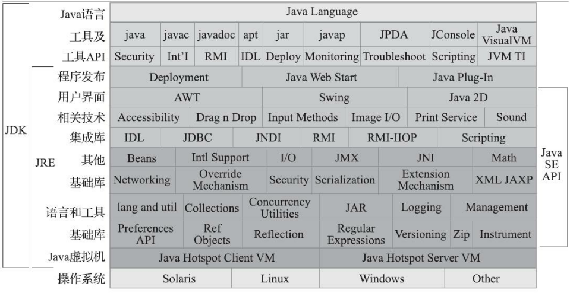

# Java基础

## Java、C++、C语言

C语言：面向过程-->数据 函数

C++，Java：面向对象-->对象 方法

C++：复杂语法，需手动释放内存，容易造成编程指针错误等

C++、C语言：可直接与操作系统进行交互，但依赖于操作系统，无移植性，通过指针，可直接操作内存，易导致错误

Java：通过虚拟机JVM（垃圾回收）与操作系统进行交互，不直接操作指针，避免的C的弊端

>面向对象：关注对象间的联系
>
>面向过程：关注数据

## JVM、JDK、JRE

JVM：java虚拟机		Java 

JDK：java开发工具包	Java Development Kit

JRE：java运行时环境		Java Runtime Environment	支持Java程序运行的标准环境 



## 类执行过程

>实例变量：没有static修饰的变量
>
>类变量：static修饰的变量

------

> 实例方法：
>
> 不加static修饰的方法
>
> 访问这类方法只能通过对象来访问
>
> 在 JVM 中调用实例方法通过局部变量表中的0号位来使用，在 JVM 中若调用实例方法，那么会在线程栈中的栈帧中的局部变量表中的0号位放入 this 关键字
>
> 类方法：
>
> 用static修饰的方法
>
> 访问这类方法可以用对象名访问，也可以使用类名调用

javac HelloWorld.java --> HelloWorld.class

java HelloWorld	 将class文件加载到虚拟机的方法区

  加载 

  验证

​	编译版本与虚拟机版本等

  准备

​    初始化类变量(static修饰的变量)为初始值，final类型变量直接初始化为变量值

> ​    byte 0	
>
> ​    short 0
>
> ​    int 0	
>
> ​    double 0.0d	
>
> ​    float 0.0f	
>
> ​    long 0L		
>
> ​    char '\u0000' ''	
>
> ​    boolean false
>
> ​    String null	

  解析

​    符号引用转为直接引用

  初始化

​    初始化类变量赋值（代码定义的）

​    static变量或static代码块按顺序组织成构造器（类构造器）来初始化变量

  使用

​    在堆内存中创建对象时的执行顺序：

​			加载实例信息进入开辟的内存中

​			执行构造方法，即方法 

  卸载

校验class文件，无误后类加载器将class文件加载到内存中，JVM找到类中的主类，然后找到main方法执行

1. Hello hello = new Hello();

线程栈中声明了一个对象Hello hello

JVM的堆内存中开辟了一块空间，创建对象，将Hello的有关信息从方法区中加载到堆内存中

- 在堆内存中创建对象时的执行顺序：

​		加载实例信息进入开辟的内存中

​		执行构造方法，即方法 

- 堆内存中创建对象的结构

  包含对象的头部信息和实例信息

  头部信息


​    	填充值

   	 指向方法区的指针

​    	描述信息，包括当前对象锁的线程的id和对象锁线程的个数，在GC中存活的生命周期数，偏向锁（当线程已经对此对象上锁，执行完毕后，如果该线程下一次访问该对象时不必重新上锁）的标志

## 面向对象的特征

- 封装

  保护数据（属性）安全，属性、方法进行了权限的设置

- 继承

  扩展

- 多态

> OOA面向对象分析
>
> ​		对象及其属性与行
>
> OOD面向对象设计
>
> ​		对OOA分析出的对象进行设计
>
> OOP面向对象编程
>
> ​		对OOD设计出的对象关系进行编码

## Object 类

> **JDK源码对于Object的说明**
>
> Class {@code Object} is the root of the class hierarchy. Every class has {@code Object} as a superclass. All objects, including arrays, implement the methods of this class.
>
> Object 类是所有类继承的根。Object 类作为每一个类的超类。所有的对象，包括数组，实现了这个类的所有的方法。

```java
private static native void registerNatives(); 
public boolean equals(Object obj) {    
    return (this == obj); 
} 
// 虚拟机栈中执行 
public String toString() {    
    // 类全名@十六进制    
    return getClass().getName() + "@" + Integer.toHexString(hashCode()); 
} 
// 本地方法栈中执行 
protected native Object clone() throws CloneNotSupportedException;
```

**方法中有 native 修饰表明该方法是通过 JNI 来调用 C语言 或 C++ 来执行**

## 集合

ArrayList

LinkedList

线性表：时间复杂度O(1)，空间复杂度O(n)

链表：节点链接，时间复杂度O(1)，空间复杂度

List中的数据结构？

ArrayList、LinkedList、Vector的区别

Set、List的区别？

HashTable、HashSet如何存储元素？

HashMap如何保存元素（equals和hashcode）？ConcurrentHashMap如何实现？

HashMap 数组+链表

## IO

InputStream	模板方法模式

FilterInputStream	装饰者模式

ObjectInputStream	对象输入流，序列化对象。什么是序列化？如何实现Java对象的序列化？序列化的作用？

**序列化**

> 将对象的信息保存到磁盘或其他可存储的介质中。

**实现序列化**

> Java 类实现 Serializable 接口 或 Externalizable 接口

```java
import java.io.*; 
public class Person implements Serializable {    
	public String name;
    public String sex;
    public int age;   
    public Person(String name, String sex, int age) { 
        this.name = name; 
        this.sex = sex;      
        this.age = age;  
    }    
    @Override   
    public String toString() {      
        return "Person{" + "name='" + name + ", sex='" + sex + ", age=" + age + '}';  
    }
    public static void main(String[] args) throws IOException, ClassNotFoundException {      
        // 在同级目录下创建 per.txt     
        File file = new File("per.txt"); 
        if (!file.exists()) {    
            file.createNewFile(); 
        }        
        // 创建序列化的对象       
        Person p = new Person("张三", "男", 22);     
        // 创建输出流   
        ObjectOutputStream oos = new ObjectOutputStream(new FileOutputStream(file));       
        // 将对象写入磁盘文件  
        oos.writeObject(p);     
        // 创建输入流     
        ObjectInputStream ois = new ObjectInputStream(new FileInputStream(file));      
        // 读取文件中的对象，反序列化   
        Person pInstance = (Person) ois.readObject(); 
        // 输出对象信息    
        System.out.println(pInstance); 
        //Person{name='张三, sex='男, age=22}  
    }
}
```

`transient` 关键字

> 对象中的属性不加与序列化，将 Person 类中的 age 属性改为 public transient int age; 
>
> 则最后输出：Person{name='张三, sex='男, age=0}

## 网络编程

UDP

广播

TCP

三次握手、一次网站访问过程

UDP与TCP的区别

TCP/IP协议栈（四层）

HTTP协议

## JDBC

连接步骤，设计缘由

DriverManager

Connection

Statement ----> PreperedStatement

ResultSet

## 多线程

线程和进程的区别？

Java 如何实现多线程？

Java 如何控制线程并发？

三个核心接口：

Runnable

Callable

Thread

Callable 和 Runnable 的区别？

Thread 类中的 stop() 为什么放弃？

线程 sleep 后会不会释放锁？

两个关键字：

synchronized	JMM？底层如何保证多线程？

volatile	如何保证内存的可见性？	原子类？且如何保证多线程并发可靠且具有原子性？

java.util.cocurrent包？

ThreadLocal

## JavaEE

Servlet

Servlet 和 JSP 有什么区别？Servlet 是不是线程安全？Servlet 的生命周期？

JSP

JSP 的三大指令、九大对象、JSTL 标签和 EL 表达式？如何自定义 JSTL 标签？ JSTL 标签解决了哪些问题？什么是域对象？

JPA

Hibernate

JMS

消息队列

JNDI

作用？

## 框架

Spring

是什么？核心技术？AOP、IOC、DI？

bean是单例还是多例？生命周期？如何实现AOP？

Spring MVC

如何处理请求？有哪些核心组件？

全局异常配置？RestFul？

Spring MVC 和 Spring 父子容器的关系？

Hibernate

体系结构？

sessionfactory

transaction

session

MyBatis

与 Hibernate 的区别？

MyBatis 的好处？

sql session factory

session

Struts

处理请求？ognl 表达式？值栈和 map 栈

mysql

执行过程？

左连接、右链接、全连接

sql优化

# JVM


https://docs.oracle.com/javase/specs/jvms/se8/html/jvms-2.html

class文件加载到方法区中

字节码文件是由字节码执行引擎执行

程序计数器值由字节码执行引擎修改

## 虚拟机栈

==线程私有的==，生命周期与线程相同，描述了Java方法执行时的内存模型；

JVM为每个执行的方法开辟一个栈帧内存空间，用来存储局部变量表、操作数栈、动态链接、方法出口等；

局部变量表中存储了Java的基本数据类型、对象引用和returnAddress，存储空间用局部变量槽表示(32位/槽)；

> returnAddress 指向字节码指令的地址

操作数栈：LIFO 存放一些临时变量（局部变量、字段中的常量或值）提供操作数并接收结果

动态链接：将符号引用转换为具体的方法引用

  

## 程序计数器

Program Counter Register，行号指示器

存放程序正在运行或马上执行代码的行号或位置，字节码解释器通过改变计数器值来选取下一条需要执行的字节码指令，每个线程独有，互不影响，避免了线程切换后再次执行时从头开始，而可以找到执行的位置，恢复继续执行

## 方法区

==线程共享==的，存储所有被加载的类变量(静态变量)，类型信息，常量(以常量表形式存在)，即时编译器编译后的代码缓存等数据

## 运行时常量池

> Class文件中有类版本、字段、方法、接口等信息；还有常量池表，存放编译期产生的字面量和符号引用，这些被加载后被存放到方法区的运行时常量池中

是方法区的一部分；具备动态性，可在编译期或运行时存入。

## 堆

==线程共享的==，在虚拟机启动时被创建的；

用来分配对象实例和数组的，所以地址空间可连续，也可不连续；

垃圾收集，回收内存，划分代

## 本地方法栈

==线程私有的==，用 native 修饰的方法，通过 JNI(Java Native Interface) 来调用 C 或 C++ 实现

垃圾回收

可达性分析算法

  GC Roots		线程栈本地变量、静态变量、本地方法栈变量等 非垃圾

  

## 字节码分析

### 指令

1. 进制转换

   javac File.class	vim打开class文件	输入`:%!xxd` 回车保存即可

2. 


javap -v file.class	输出字节码的附属信息

invokevirtual 调用对象的实例方法

invokespecial 调用需要特殊处理的实例方法，private方法、构造方法、超类方法

方法描述

public void say(double d, int i) {

​		System.out.print(d + i);

}

public void say(double, int);

descriptor: (DI)V		方法描述 (参数类型)返回值类型

flags: ACC_PUBLIC	方法修饰符 ACC_STATIC、ACC_FINAL

Code:

stack=5, locals=4, args_size=3		栈深度、本地变量个数、参数个数

0: getstatic   #2         // Field java/lang/System.out:Ljava/io/PrintStream;

3: dload_1	将 dload_1 压栈

4: iload_3	将 iload_3 压栈

5: i2d

6: dadd	遇到运算，依次从栈中弹出两个变量进行运算，结束后将结果压栈

7: invokevirtual #4         // Method java/io/PrintStream.print:(D)V	打印

10: return

LineNumberTable:

line 7: 0

line 8: 10