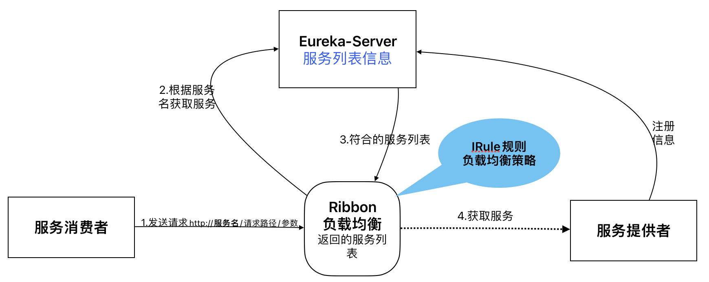
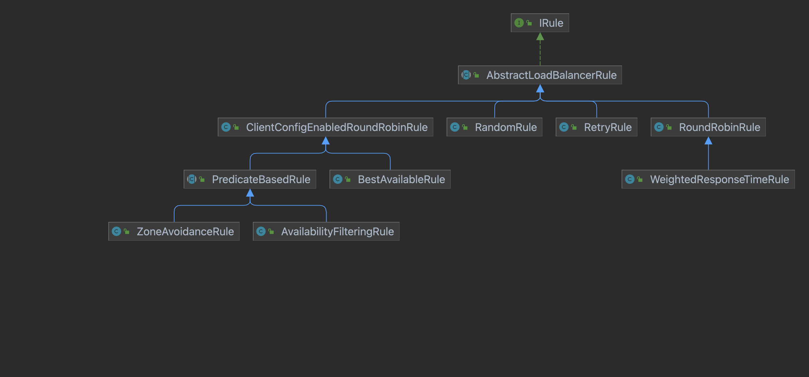
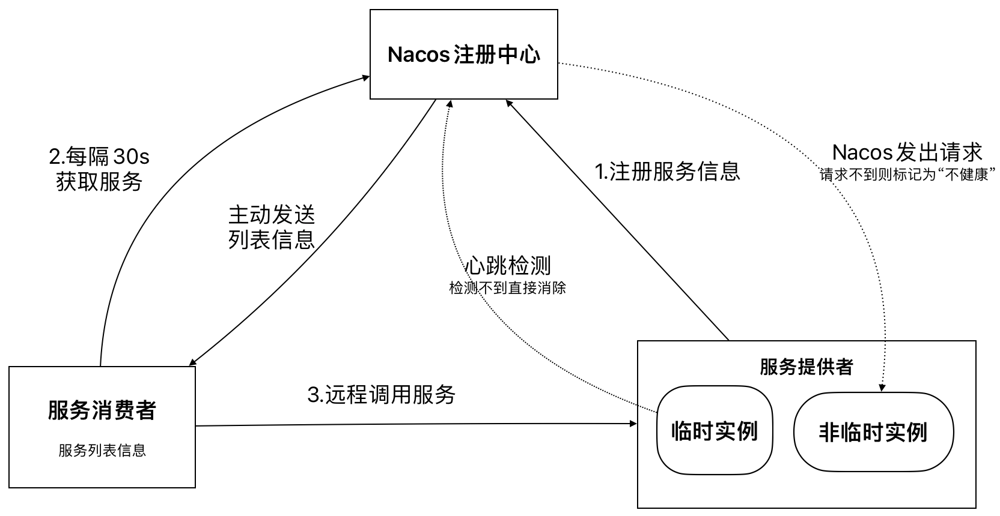
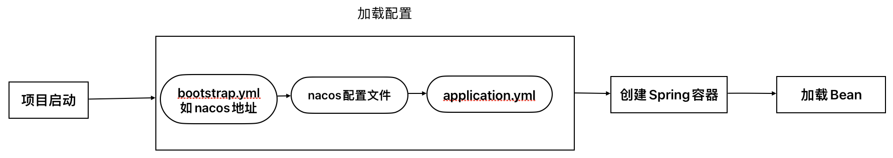
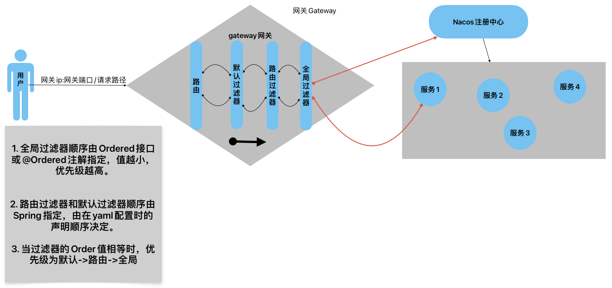
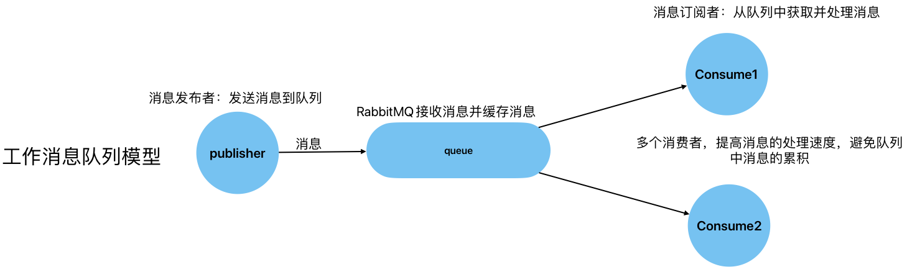
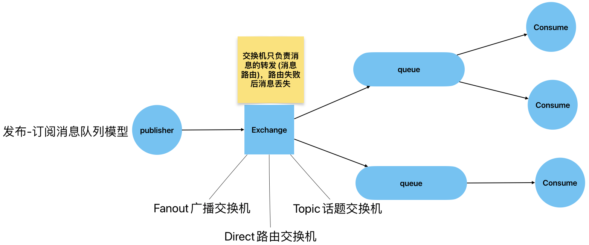

# Spring

## Spring 框架

Spring 框架是轻量级的 Java 开发框架，整合了诸如 JDBC 、MyBatis 等架构，减少了开发过程中的复杂性，拥有 AOP (面向切面的编程)和 IoC (控制反转)主要两大核心内容，追求代码的解耦和复用。

## IoC

IoC (Inversion of Control) ，控制反转，是 Spring 容器对对象的管理，由 Spring 容器来帮助我们进行对象创建和依赖注入(Dependency Injection)，我们在开发过程中可以直接使用这些对象。

### 创建对象

#### 基于XML配置文件

- 创建一个实体类，com.spring.Person.java
  
  ```java
  public class Person {
      private String name;
      private int age;
  
      public Person() {
          System.out.println("new Person()");
      }
  
      public Person(String name, int age) {
          this.name = name;
          this.age = age;
          System.out.println("new Person(name, age)");
      }
  
      @Override
      public String toString() {
          return "Person{" +
                  "name='" + name + '\'' +
                  ", age=" + age +
                  '}';
      } 
  }
  ```

- 传统创建对象方式
  
  ```java
  Person p1 = new Person();
  ```

- Spring 创建对象方式
  
  - 在配置文件 applicationContext.xml 中创建，id 值为对象名称，class 值为对象类全名，用此方式创建对象，默认调用无参改造方法，所以 **<mark>必需提供无参构造方法</mark>**
    
    ```xml
    <bean id="p1" class="com.spring.Person"></bean>
    ```
  
  - 利用有参构造方法创建对象
    
    > - 通过构造方法参数名
    > 
    > - 通过构造方法参数下标
    > 
    > - 通过构造方法参数的默认顺序
    
    ```xml
    <!-- 通过参数名称创建 -->
    <bean id="p2" class="com.spring.Person">
        <constructor-arg name="name" value="wangwu" />
        <constructor-arg name="age" value="20" />
    </bean>
    <!-- 通过参数下标创建 -->
    <bean id="p3" class="com.spring.Person">
        <constructor-arg index="0" value="wangwu" />
        <constructor-arg index="1" value="20" />
    </bean>
    <!-- 通过参数默认顺序创建 -->
    <bean id="p3" class="com.spring.Person">
        <constructor-arg name="name" value="wangwu" />
        <constructor-arg name="age" value="20" />
    </bean>
    ```

- Spring 帮助我们创建完对象，我们如何获取对象使用？
  
  ```java
  // 创建容器对象并启动容器
  // 在这里对调用无参构造方法，为每个 bean 标签创建对象
  ApplicationContext context = 
             new ClassPathXmlApplicationContext("applicationContext.xml");
  // 获取容器创建的对象
  Person p1 = (Person) context.getBean("p1");
  ```

- 创建对象的同时为属性赋值，为属性赋值，name 值为属性名，**<mark>必须提供setXXX(XXX)方法</mark>**
  
  > 基本类型属性赋值用 value
  > 
  > 引用类型属性赋值用 ref，该引用类型的数据应在 Spring 容器中创建过的对象，也可称为 DI
  
  这里创建一个com.spring.Company类，作为 Person 类的属性
  
  ```java
  public class Company {
      private String name;
      private int salary;
      private String position;
      @Override
      public String toString() {
          return "Company{" +
                  "name='" + name + '\'' +
                  ", salary='" + salary + '\'' +
                  ", position='" + position + '\'' +
                  '}';
      }
  }
  ```
  
  - 修改 Person 类中的 toString() 方法并添加 Company 对象的属性和 setCompany(company)方法
  
  ```xml
  <bean id="p1" class="com.spring.Person">
      <!-- 基本类型属性 -->
      <property name="name" value="李四" />
      <property name="age" value="18" />
      <!-- 引用类型属性，ref 值为 spring容器创建的对象id -->
      <property name="company" ref="company" />
  </bean>
  
  <!-- 创建Company 对象-->
  <bean id="company" class="com.spring.domain.Company">
      <property name="name" value="XXX公司" />
      <property name="salary" value="10000" />
      <property name="position" value="项目经理" />
  </bean>
  ```

#### 基于注解

```java
@Component("stu") // @Component 创建对象名称默认为student
public class Student {
    @Value("zhangsan") // 不需要 set 方法
    private String name;
    @Value("18")
    private int age;
    @Value("女")
    private String sex;
    @Autowired
    @Qualifier("school") // School 类中 Component 无参数，默认实体Bean名称为 school
    private School school;

    public Student() {}
}
```

基于注解创建对象，需要在 .xml 文件中配置包扫描机制

```xml
<!-- 在配置多个包扫描时，base-package 值中多个包间可用逗号分隔 -->
<context:component-scan base-package="com.spring" />
```

当有多个XML文件，需整合配置文件，xml 文件导入方式

```xml
<!-- 单个文件导入 -->
<import resource="application.xml" />
<!-- 多个文件的导入，将名字为 application_XXXXX 的 xml 都进行导入 -->
<import resource="application_*.xml" />
```

创建一个 School ，用于在 Student 类中 `@Autowired` 引用类型注入

```java
@Component
public class School {
    @Value("北大")
    private String name;
    @Value("北京")
    private String address;

    public School() {}
}
```

- `@Component`
  
  是类类型的注解，可用于在 Spring 管理的任何组件
  
  对象默认为类名小驼峰式，我们也可以自定义名称

- `@Controller`
  
  在表示层/控制层创建对象使用

- `@Service`
  
  在服务层创建对象使用

- `@Repository`
  
  在数据持久层创建对象使用

- `@Value`
  
  可用于属性、方法或构造方法参数级别上，用于注入基本类型和 String 类型数据
  
  优点在于不用写属性的 setXXX(XXX) 方法

- `@Autowired`
  
  用于类型匹配注入值，常用于注入引用类型
  
  > `@Autowired`在被注入类具有子父类关系注入时，有多个类型进行注入，Spring 会进行筛选，选取名字一样的进行注入，为避免错误，则可使用`@Autowired`于`@Qualifioer`结合指定名称进行注入

- `@Autowire` 和 `@Qualifior`
  
  用于引用类型通过 bean 名称注入，使用`@Qualifior`时必须指定注入的名称

## AOP

AOP(Aspect Oriented Programing)，面向切面编程，AOP的模块单元是切面。

他是将业务逻辑的公共部分进行抽取，实现业务逻辑部分与各个部分进行解耦，提高代码的复用性，实际则为动态代理。

### 常应术语

1. 切面 Aspect

   关注点模块化

   即需增强的功能

2. 连接点 Join Point

   在程序执行过程中某个特定的点，如某个方法调用的时间点或者处理异常的时间点

   在通知类型中可获取这个点，`JoinPoint` 对象可获取签名

   切点 Pointcut

   匹配连接点的断言，即`通知`应用的类或方法。通知和切点表达式相关联，并在满足这个切点的连接点上运行（例如，当执行某个特定名称的方法时）

   切入点表达式：

   - 方法级别 `execution([访问权限] 方法返回值 方法名(参数) [异常])`

   - 类级别 `within(package.*)` 

   - 基于注解 `@annatation(com.annotion.X)` 

     ```java
     @Retention(RetentionPolicy.RUNTIME) // 生效时间
     @Target(ElementType.METHOD) // 作用范围
     public @interface Advice {
     }
     
     @Around(value = "@annotation(com.annotation.Annotat)")
     public Object surround(ProceedingJoinPoint point) {
         Object procced = point.procced();
         return procced; // 处理目标方法的结果
     }
     ```

3. 目标对象 Target Object

   被一个或者多个切面所通知的对象

4. 通知 Advice

    在切面的某个特定的连接点上执行的动作，即一个操作功能，如 around、before、after 等

5. 织入 Weaving

   把切面连接到其它的应用程序类型或者对象上，并创建一个被被通知的对象的过程

> Aspect = Advice + Pointcut


### 通知类型

* 前置通知（Before advice） 

  在连接点之前运行但无法阻止执行流程进入连接点的通知（除非它引发异常）。

* 后置返回通知（After returning advice）

  在连接点正常完成后执行的通知（例如，当方法没有抛出任何异常并正常返回时）。

* 后置异常通知（After throwing advice）

  在方法抛出异常退出时执行的通知。

* 后置通知（总会执行）（After (finally) advice）

  当连接点退出的时候执行的通知（无论是正常返回还是异常退出）。

* 环绕通知（Around Advice）

  环绕连接点的通知，例如方法调用。这是最强大的一种通知类型，。环绕通知可以在方法调用前后完成自定义的行为。它可以选择是否继续执行连接点或直接返回自定义的返回值又或抛出异常将执行结束。

### AspectJ

基于 Java 语言开发的一个面向切面的框架，可实现无缝扩展

业务对象和切面的绑定 `<aop:aspectj-autoproxy></aop:aspectj-autoproxy>`

#### 通知注解

**常见的切面类型**

- `@Aspect`
  
  切面类注解，注解一个切面类，AspectJ 框架扫描注解识别切面

- `@Before(value = "切入点表达式")`
  
  通知方法：public void methos([JoinPoint joinPoint])
  
  在切面方法中可有一个参数 `JoinPoint` 对象，可获得目标方法的签名(访问权限、返回值类型、方法名全路径、参数类型)和参数内容

- `@AfterReturning(value = "切入点表达式", returning = "目标方法的返回值名称，要与切面方法的参数名一致")`
  
  通知方法：public void method([Object obj])
  
  切面方法中的参数 `Object` 为目标方法的返回值，在切面方法中可根据需要进行处理

- `@Around(value = "切入点表达式")`
  
  在目标方法执行前后增强功能，一般用于事务处理，可改变目标方法的返回值
  
  通知方法：public Object method(ProceedingJoinPoint point)
  
  参数：为处理过程中的连接点

  返回值：返回业务处理结果返回给调用者-->procced
  
  Object procced = point.procced(); // 进入目标方法
  
- `@After(value = "切入点表达式")`
  
  无论目标方法是否正常执行，最终通知都会执行，异常使用
  
  通知方法：public void method([JoinPoint point])
  
  ---

- `@Pointcut(value = "切入点表达式")`
  
  > `@Pointcut` 注解即为一个切入点表达式的别名，如下代码，可在通知注解中使用，如 `@Before(value = "cut()")`
  
  ```java
  @Pointcut(value = "execution(returntype method(argstype)")
  public void cut() {}
  ```

## 事务

### Spring 的事务管理

1. 注解式
   
   `@transactional`
   
   > 在业务方法上进行添加，对该业务类中的所有方法都有效
   
   - propagation 设置事务的传播特性
   
   - noRollbackForClassName 指定发生异常不回滚
   
   - rollbackForClassName 指定异常发生回滚
   
   - timeout 设置连接超时，默认值为 -1，永不超时
   
   - reaOnly 默认 false，允许增删改，若为查询，则必须设置为 true
   
   - isolation 设置数据的隔离级别，一般为 Isolation.DEFAULT

2. 声明式
   
   在配置文件中添加

### 五大级别

1. read uncommitted
   
   未提交读：允许读取事务未提交的数据，允许脏读

2. read committed
   
   提交读：允许读取事务提交的数据，

3. repeatable read
   
   可重复读：

4. serializable
   
   串读：较少

5. default

MySQL：默认处理级别为 可重复读

Oracle：支持 read committed 和 serializable ，默认为 读已提交

### 传播特性

多个事务之间的合并、互斥等，都可通过设置事务的传播特性解决。

## 项目配置

### db.properties文件

```properties
jdbc.driverClassName=com.mysql.cj.jdbc.Driver # mysql 8
jdbc.url=jdbc:mysql://localhost:3306/database?characterEncoding=UTF-8
jdbc.username=root
jdbc.password=123456
```

### pom.xml文件

```xml
<build>
    <resources>
        <directory>src/main/resources</directory>
        <includes>
            <include>**/*.xml</include>
        </includes>
    </resources>
</build>
```

### spring application.xml

- 读取 properties 属性文件

- 创建数据源dataSource( druid 数据库连接池)

- 配置 SqlSessionFactoryBeean
  
  - 配置数据源，注入dataSource
  
  - 配置 MyBatis 的核心配置，即Mapper.xml的位置
  
  - 注册实体类别名(类名)

- 注册 mapper.xml，创建DAO

- 事务
  
  - 添加事务管理器，配置数据源
  
  - 添加事务注解驱动，开启事务管理

```xml
<context:property-placeholder location="classpath:db.properties" />

<bean id="dataSource" class="com.alibaba.druid.pool.DruidDataSource">
    <property name="driverClassName" value="${jdbc.driverClassName}" />
    <property name="url" value="{jdbc.url}" />
    <property name="username" value="${jdbc.username}" />
    <property name="password" value="${jdbc.password}" />
</bean>

<bean class="com.mybatis.spring.SqlSessionFactoryBean">
    <property name="dataSource" ref="dataSource" />
    <property name="mapperLocations" value="classpath:com/mapper/*.xml" />
    <!-- <property name="configLocation" value="SqlMapConfig.xml" /> -->
    <property name="typeAliasesPackage" value="com.project.entity" />
</bean>

<bean class="org.mybatis.spring.mapper.MapperScannerConfigurer">
    <property name="basePackage" value="com.project.dao" />
</bean>

<bean id="transactionManager" class="org.springframework.jdbc.datasource.DataSourceTransactionManager">
    <property name="dataSource" ref="dataSource" />
</bean>

<tx:annotation-driven transaction-manager="transactionManager"></tx:annotation-driven>
```

---

### Mapper配置

```xml
<?xml version="1.0" encoding="UTF-8" ?>
<!DOCTYPE mapper
        PUBLIC "-//mybatis.org//DTD Mapper 3.0//EN"
        "http://mybatis.org/dtd/mybatis-3-mapper.dtd">
<mapper namespace="com.project.dao.ClassDao">
</mapper>
```

# Spring MVC

## 配置

### web.xml

- 配置Spring、Springmvc
- 配置前端控制器
- 配置 servlet 映射
  - /                    匹配除 .jsp 外的请求
  - /*                  匹配所有的请求(不建议)
  - *.do              匹配请求的结尾未 .do
  - /name/*       匹配
- 配置编码过滤器，设置编码，处理请求参数内容乱码问题
- 配置请求过滤器：Post -> Put、Delete

```xml
<!-- 加载spring.xml -->
<context-param>
    <param-name>contextConfigLocation</param-name>
    <param-value>classpath:spring.xml</param-value>
</context-param>
<!-- 配置spring工厂 -->
<listener>
    <listener-class>org.springframework.web.context.ContextLoaderListener</listener-class>
</listener>
<!-- 配置 springmvc -->
<servlet>
    <servlet-name>springmvc</servlet-name>
    <servlet-class>org.springframework.web.servlet.DispatcherServlet</servlet-class>
    <!-- 初始化参数，配置xml文件，指定位置 -->
    <init-param>
        <param-name>contextConfigLocation</param-name>
        <!-- 配置的 IoC 容器 -->
        <param-value>classpath:spring-mvc.xml</param-value>
    </init-param>
    <!-- 服务器启动时初始化 DispatcherServlet，加载配置文件 spring-mvc.xml -->
    <load-on-startup>1</load-on-startup>
</servlet>
<!-- 配置 servlet 的映射 -->
<servlet-mapping>
    <servlet-name>springmvc</servlet-name>
    <!-- 拦截的请求，除 .jsp 的请求，如 request 请求，拦截后，由前端控制器负责分发至不同的控制器 -->
    <url-pattern>/</url-pattern>
</servlet-mapping>
<!-- 编码 -->
<filter>
    <filter-name>characterEncodingFilter</filter-name>
    <filter-class>org.springframework.web.filter.CharacterEncodingFilter</filter-class>
    <!-- 设置编码格式 -->
    <init-param>
        <param-name>encoding</param-name>
        <param-value>UTF-8</param-value>
    </init-param>
    <!-- 请求和响应编码开启 -->
    <init-param>
        <param-name>forceEncoding</param-name>
        <param-value>true</pavram-value>
    </init-param>
</filter>
<!-- 设置匹配的规则 -->
<filter-mapping>
    <filter-name>characterEncodingFilter</filter-name>
    <!-- 指定过滤的 servlet -->
    <servlet-name>springmvc</servlet-name>
</filter-mapping>

<!-- 请求 -->
<filter>
    <filter-name>hiddenHttpMethodFilter</filter-name>
    <filter-class>org.springframework.web.filter.HiddenHttpMethodFilter</filter-class>
</filter>
<filter-mapping>
    <filter-name>hiddenHttpMethodFilter</filter-name>
    <servlet-name>springmvc</servlet-name>
</filter-mapping>
```

### springmvc.xml

- 配置注解驱动
- 配置静态资源，在页面引用时需添加项目名，如 `` 
- 配置视图解析器，防止用户直接访问 jsp，限制用户访问 WEB-INF
- 配置视图控制器，jsp页面不经过前端控制器，直接在地址栏中输入地址访可WEB-INF中的JSP

```xml
<!-- 注解驱动 -->
<mvc:annotation-driven />
<!-- /web/images/pngs，启动服务器可localhost:8080/images/1.png -->
<mvc:resource mapping="/images/**" location="/images/" />
<!-- mapping为不会拦截的路径的请求地址，location为web根目录下静态资源的位置-->
<mvc:resource mapping="/css/**" location="/css/" />

<!-- 解析器 -->
<bean id="" class="InternalResourceViewResolver">
    <property name="prefix" value="/WEB-INF/views/" />
    <property name="suffix" value=".jsp" />
</bean>

<!-- 必须保证请求是独有的，不二的 -->
<!-- 控制器  path为请求路径  view为视图名称 localhost:8080/projectName/mvc，即可跳转到/WEB-INF/views/mvc.jsp页面 -->
<mvc:view-controller path="/mvc" view="mvc" />
```

## 注解

### Controller

作用于类，如 web 层的 controller

通常于 `@RequestMapping` 一同使用

### RequestMapping

作用于 controller 类或类方法，具有解决请求路径冲突问题，不同的 controller 类可有相同的方法请求，在方法级别上，可用 `@GetMapping` 、`@PostMapping` 、`@PutMapping` 、`@DeleteMapping` 和 `@PatchMapping` 请求映射替代

> 以下可用于REST风格的请求路径： /path/{id}
> 
> `@GetMapping`       查询    Get请求
> 
> `@PutMapping`       修改    Put请求
> 
> `@PostMapping`     增加    Post请求
> 
> `@DeleteMapping` 删除    Delete请求
> 
> **但是，html表单只支持Get和Post请求，且默认为Get请求**
> 
> **解决？？？**
> 
> 利用`HiddenHttpMethodFilter`过滤器，在表单中设置一个<mark>隐藏域</mark> `<input type="hidden" value="put" name="_method" />`，请求经过过滤器，判断当前请求是否为Post，找隐藏域中的参数值匹配，将Post转换为Put(创建一个servlet request)

`@RequestMapping("/url")` 表明一个 web 请求到请求处理类的一个方法的映射，url 为请求路径

- value   请求的路径，支持通配符 **(ant-style)** 匹配路径
  
  ?        匹配一个占位符
  
  \*        匹配任意字符
  
  **       匹配任意级目录
  
  > 匹配优先级：详细请求>？>*>**

- method   设置请求的方式，如 GET、POST、HEAD、PUT、OPTIONS等

- params   设置请求的参数，可取反

- headers   获取请求头

- consumes   获取请求的媒介类型

- produces

### RequestParam

作用于方法参数

`@RequestParam(name = "", required = "", defaultValue = "")` 绑定 web 请求参数与处理请求方法的参数

- name   请求参数的名字，与 `value` 相同

- required   是否需要传值，默认为 `true` ，请求中必须传递参数，否则会抛出异常

- defaultValue   为参数设置默认值，此时 `required = "true"` 且请求无参时不会抛异常

> 请求处理方法参数，类型应为引用数据类型，当required = "false" ，请求可不设置参数，此时参数默认为 null，例如：int username = null 是错误的

### RequestHeader

### CookieValue

### PathVariable

作用于方法参数上

 `@PathVariable(value = "param", required = "")` 绑定请求 **(/path/{param1}/{param2})** 参数与处理方法的参数，方法参数也可以是一个对象，但是对象属性名称需与参数名相同

### ModelAttribute

作用于参数级或方法级别上

作用于方法级别，在本控制类中所有的请求方法执行前都会执行该注解方法-------可用来设置session全局变量与修改查询到的全部字段的指定字段

作用于参数级别，可从 Model 中获取指定的属性与参数合并

## 模型

1. `Model` 、 `ModelMap` 、 `Map` 、 `ModelAndView` ，向页面传输数据，底层为 `Servlet` 技术 **[HttpServletRequest]**，将数据存放至  `requestScope`  中
   
   > Spring MVC 在进行请求-处理方法参数绑定前，会将 Model 中符合的的参数进行合并

2. 原始 `Servlet` 、 `HttpSession` 自动注入或 Spring MVC 注解方式存放数据至 `sessionScope` 中
   
   - `@SessionAttributes({"val"})` 作用于方法级，在 Model 中找相应 val 的属性值写入 Session中，可通过 `${sessionScope.val}` 获取
   
   - `@SessionAttribute(value = "name", required = false) type vsal` 作用于参数级，可获取 session 中的某个属性

## 转发和重定向

转发

在服务端发生，用户的浏览器地址栏不变；只发生一次请求；请求域中的数据不会丢失；根目录是包含项目名

```java
public String forward() {
    return "view"; //配置过视图解析器，进行默认转发
    //return "forward:/index.jsp"; //需要返回完整的视图名称路径，不会经过视图解析器
}
```

重定向

在浏览器中发生，地址栏会发生变化，显示最新的请求路径；发生了两次请求，第二次是get请求；请求域中的数据会丢失；根目录不会包含项目名

```java
public String redirect() {
    return "redirect:/index.jsp"; 
    //不会经过视图解析器，必须有 redirect 关键字，重定向是不包含项目名的，但是Spring MVC 会自动帮助添加
}
```

## 类型转换

Spring 框架中请求参数和控制类处理方法中的参数可自行匹配，自动进行类型转换

也可以自定义类型转换器

需实现： `org.springframework.core.convert.converter.Converter<S, T>` 接口，重写`convert()`

spring-mvc.xml 配置

```xml
<!-- 转换驱动 -->
<mvc:annotation-driven conversion-service="conversion" />
<!-- 自定义类型转换器 -->
<bean id="conversion" class="ConversionServiceFactoryBean">
    <property name="converters">
        <set>
            <bean id="nameStr" class="自定义转换类"/>
        </set>
    </property>
</bean>
```

## 数据格式化

数据格式化包括：数字、日期和时间的格式化

- `@NumberFormat` 
  
  声明一个字段或方法参数作为一个数字
  
  Style 枚举类型：number、percent、currency 数字、百分比、货币格式

- `@DateTimeFormat` 
  
  声明一个字段或方法参数作为一个日期或者时间
  
  pattern：日期的格式

```java
/** 实体类 */
@DateTimeFormat(pattern = "yyyy,MM,dd")
private Date date;

@NumberFormat(style = NumberFormat.Style.CURRENCY)
private Double salary;
```

```xml
<!-- spring-mvc.xml 配置类型转换和数据格式化工厂 -->
<bean id="factoryBean" class="FormattingConversionServiceFactoryBean">

</bean>
```

```html
<!-- 数据显示页面jsp -->
<!-- 导入spring标签库，遍历类中的数组类型属性，自动循环 -->
<%@taglib prefix="spring" uri="http://www.springframework.org/tags" %>
数组：<spring:eval expression="hobbies"></spring:eval>
<!-- 直接显示格式化后的日期 -->
日期：<spring:eval expression="brith" />
薪资：<spring:eval expression="salary" />
```

## 数据验证

JavaScript 可以完成前端的数据检验，但是是不安全的，通常采用 前端+后端 进行检验。后端使用 **JSR(Java Specification Requests)** 标准规范，使用 **Hibernate Validator**框架，在 JavaBean 的属性字段添加注解，标明规范。

1. 添加 hibernate-validator 6 依赖
   
   ```xml
   <dependency>
       <groupId>org.hibernate.validator</groupId>
       <artifactId>hibernate-validator</artifactId>
       <version>6.1.5.Final</version>
   </dependency>
   ```

2. 在 Java Bean 实体字段添加注解
   
   注解所在包：
   
   `javax.validation.constraints` 和 `org.hibernate.validator.constraints`
   
   ```java
   @NotNull(message = "username为空")
   @Length(min = 5, max = 20, message = ""用户名长度不符合要求)
   private String username;
   ```

3. 在控制层处理方法参数前声明 `@Valid` ，表示该参数需要进行数据验证，在运行时检验可能会出现 404 页面，需在处理方法添加 `BindingResult` 类型的参数，验证结构存储在了该参数对象中，Model 可用于输入页面对错误的提示
   
   ```java
   // result 中存储了 Obj 对象的错误字段及信息
   @RequestMapping("/handel")
   public String handle(@Valid Obj obj, BindingResult result, 
                                                       Model model) {
       if (result.hasErrors() {
           // 存储错误信息
           Map<String, String> map = new HashMap<>();
           // 获取错误属性和信息
           List<FieldError> errors = result.getFieldErrors();
           for (FieldError error : errors) {
               map.put(error.getField(), error.getDefaultMessage());
           }
           mode.addAttribute("error", map);
           return "源页面";
       }
   
       return "view";
   }
   ```
   
4. 在页面获取信息，可使用 EL 表达式或 Spring form 标签库，使用 Form 标签库可省略部分代码
   
   > 在使用 Spring form 标签库前必须传递一个 Bean 到 Model 中，form 标签中必须指定 modelAttribute 属性值，为绑定的 JavaBean
   >
   > 且Spring Form标签库默认有隐藏域，可支持 Put 等请求
   
   ```html
   <!-- EL -->
   ${error.fieldName}
   
   <!-- 引入标签库 -->
   <%@ taglib prefix="form"
        uri="http://www.sprringframework.org/tags/form" %>
   
   <form:form action="" modelAttribute="" method="post">
       <form:input path="id" /> <form:errors path="id" />
       <!-- form标签动态绑定List[path为属性名，items为model中的name值] -->
       <form:checkboxes path="listAttribute" items="${list}"></form:checkboxes>
       <!-- form标签动态绑定Map -->
       <form:checkboxes path="hobbies" items="${map}"></form:checkboxes>
   </form:form>
   ```
   
   ```java
   @RequestMapping("/handel")
   public String handel(@Valid Obj obj, BindingResuult result) {
       if (result.hasErrors()) {
           return "/输入页面";
       }
       return "成功转向页面"
   }
   
   /** 向输入页面传入 Bean */
   @RequestMapping("/输入页面的请求")
   public String bindbean(Obj obj) {
       return "输入页面";
   }
   ```
   

## JSON

接收json数据

`@RequestBody`

```js
$(function() {
    $.ajax({
        url: "/request",
        method: "post",
        // data: "zhangsan", // 传输单个数据
        // data: '{"key1": "val1", "key2": "val2", "key3": "val3"}',//传输对象、Map类型数据，传输的JSON格式必须外部为单引号，内部数据为双引号
        data: '[{"id": 1, "name": "zhangSan", "brith": "2022-3-1", "password": "123467"}, {"id": 2, "name": "zhang", "brith": "2020-3-1", "password": "123467"}]', // 传输List类型数据
        contentType: "application/json",
        dataType: "json",
        success: function(obj) {
            console.log(obj);
        }
    });
});
```

```java
@PostMapping("/request")
@ResponseBody
public Obj req(@RequestBody String name) {
    Obj obj = new Obj();
    return obj;
}
```


返回json数据

`@ResponseBody` 

作用于方法或类上

将返回值作为文本返回，并不是返回视图逻辑名称

```java
@RequestMapping("json")
@ResponseBody
public Obj json() {
    Obj obj = new Obj();
    return obj;
}
```

只能返回字符串格式和Model内容到页面，无法传入一个对象，Spring 集成了 jackson ，需添加 jackson-core、jackson-databind 和 jackson-annotations 依赖，即可将任何对象转换为 JSON 格式返回给页面

`@RestController` 

作用于控制类，相当于 `@Controller` 和 `@ResponseBody` 

JSON中重要的两个注解：

`@JsonIgnore` 在序列化(Obj->json)和反序列化(json->Obj)时忽略被注释的属性

`@JsonFormat` 在序列化时格式化日期的属性

## 拦截器

类似于过滤器，来拦截处理方法，在前和后执行一些和主业务没有关系的一些公共功能，如权限验证、日志和异常记录等，需实现 `HandlerInterceptor` 接口。

定义拦截器，实现接口

```java
public class Interceptor implements HandlerInterceptor {
    // 在处理方法执行前 false会中断后续的拦截执行，不会执行处理方法、postHandler、afterCompletion
    public boolean preHandle(HttpServletRequest, HttpServletResponse, Object handler) {
        // 登录验证功能
        HttpSession session = request.getSession();
        if (session.getAttribute("username") == null) {
            // 说明没有登录
            response.sendRediect("重定向路径");
            // 不在执行处理方法和拦截器
            return false;
        } else {
            return true;
        }
    }
    // 在成功执行处理方法后，且在视图呈现之前
    public void postHandle(HttpServletRequest, HttpServletResponse, Object handler, ModelAndView) {}
    // 在处理方法完成后，且在视图呈现后，可进行异常的处理，如异常记录
    public void afterCompletion(HttpServletRequest, HttpServletResponse, Object handler, Exception ex) {}
}
```

> Object handler封装了拦截方法的信息，默认输出 `包#方法名()` ，可使用类型转换 `HandlerMethod handlerMethod = (HandlerMethod) handler` 。

spring-mvc.xml 中配置拦截器

```xml
<mvc:interceptors>
    <!-- 拦截所有的请求 -->
	<bean id="interceptor" class="Inteceptor"></bean>
    <!-- 配置拦截的请求 -->
    <mvc:interceptor>
        <!-- 拦截所有的请求 -->
    	<mvc:mapping path="/**" />
        <!-- 取消拦截的请求 -->
        <mvc:exclude-mapping path="login" />
        <bean id="interceptor" class="Inteceptor" />
    </mvc:interceptor>
</mvc:interceptors>
```

> 拦截器和过滤器，过滤器先执行
>
> 过滤器是基于函数回调的，且依赖于servlet容器，对所有请求都有作用；
>
> 拦截器是基于反射的，依赖于Spring MVC，只拦截对于Spring MVC的请求，可访问处理方法的上下文。


## 国际化

- 新建目标语言的资源文件

  在资源文件夹中创建 properties 文件， 使用 Resource Bundle Editor 插件进行新建 K-V 内容

  resources

  ------i18n

  ------------Resource Bundle 'login' // idea自己识别

  ------------------login.properties

  ------------------login_en_US.properties

  ------------------login_zh_CN.properties

- Spring MVC 配置

  ```xml
  <bean class="ResourceBundleMessageSource" id="resourceBundleMessageSource">
      <property name="basenames">
          <array>
              <value>i18n/login</value>
          </array>
      </property>
  </bean>
  ```

- 在页面文件中调用properties配置

  ```jsp
  <%@ taglib prefix="spring" uri="http://www.springframework.org/tags" %>
  <spring:message code="properties.K"></spring:message>
  ```


# SpringBoot

Spring Boot 是基于 Spring 开发的，简化了Spring应用的整个开发和环境搭建过程，提供了许多的默认配置，可以做到 **几乎零配置、开箱即用** ；框架 **约定大于配置** ，可以按其约定的静态资源位置等，避免了在 xml 文件中对其配置；SpringBoot 自己有内嵌的 Tomcat，不在需要部署WAR包，节省了开发时间；解决了依赖包的版本冲突等问题。

## SpringBoot 搭建

### 约定及入口注解

- 项目中有且仅有一个入口类 `Application` ，并注释 `@SpringBootApplication` ，该入口类在所有的子包之上，Application 类中需要有一个 main 函数，用以启动项目

  - `@SpringBootApplication` 

    > 表明一个或多个Bean 注释的方法的配置类并且触发了 *自动配置* 和 *组件扫描* 。他是一个方便的注解且与`@Configuration` 、`@EnableAutoConfiguration`  、`@ComponentScan` 的组合体是等效的。——SpringBootApplication类的头注释
    >
    > - `@Configuration` 
    >
    >   自动地进行 Spring 的标准配置、初始化相关环境，注解一个配置类
    >
    > - `@EnableAutoConfiguration` 
    >
    >   自动配置 Spring 应用的上下文，尽可能的配置可能用到的 bean，自动配置一些 classpath 中提供的类和已经在程序中定义的 bean，即可对引入的第三方技术诸如MyBatis、MySQL进行配置。
    >
    > - `@componentScan` 
    >
    >   配置注解扫描，默认当前包及子包 `<context:component-scan />` 

    只能用来注释类，表明被注释类为 SpringBoot 项目的启动类，作为项目的入口

  - `Application.java` 

    ```java
    /**
    @Configuration
    @EnableAutoConfiguration
    @ComponentScan
    */
    @SpringBootApplication //等效于上述三个注释
    @MapperScan("com.springboot.dao") //注册MyBatis接口，创建dao对象；还有 @Mapper，在Dao层接口上，用于创建dao对象
    public class Application {
        public static void main(String[] args){
            // 启动 SpringBoot 应用（入口类.class, main函数的参数）
            // args：在测试时动态的传入一些参数，便于测试
            SpringApplication.run(Application.class, args);
        }
    }
    ```
    
    

- 在 SpringBoot 项目 resources 的根目录下存有 `application.properties` 或 `application.yml` 的配置文件

> src
>
> ----main	运行时
>
> --------java
>
> ------------entity
>
> ------------dao
>
> ------------controller
>
> ------------service
>
> ------------Application.java
>
> --------resources
>
> ------------com/springboot/mapper 存放mapper配置文件，必须 “/” 方式创建文件夹
>
> <font color="red">Invalid bound statement (not found): com.springboot.springbootinit.dao.UserDao.findAll with root cause</font>
>
> ------------static   存放 image、css、js
>
> ------------templates   存放模板，如 thymeleaf 模板
>
> ------------application.yml/application.properties
>
> ------------application-test.yml
>
> ------------application-product.yml
>
> ----test	测试时(不会打包部署)
>
> --------java
>
> --------resources

### pom.xml

- 引入父项目依赖，没有下载依赖包，便于维护版本
- 添加 spring-boot-starter-web 依赖

```xml
<parent>
    <groupId>org.springframework.boot</groupId>
    <artifactId>spring-boot-starter-parent</artifactId>
    <version>2.6.10</version>
</parent>
<dependencies>
    <dependency>
        <groupId>org.springframework.boot</groupId>
        <artifactId>spring-boot-starter-web</artifactId>
	</dependency>
    <!-- 使用JSP开发，需添加c标签库jstl和解析库tomcat-embed-jasper -->
    
    <!-- mybatis: mybatis-spring-boot-starter、mysql驱动、druid源 -->
    
    <!-- 热部署:
 	     1).再在 IDEA 中开启自动编译 setting->Compiler->Build project automatically 
		 2).设置允许程序运行中修改文件 Ctrl+Alt+shift+/->Registry->compiler.automake.allow
			或设置setting->Advanced Settings->Allow auto-make to start even if developed .......
	-->
    <dependency>
        <groupId>org.springframework.boot</groupId>
        <artifactId>spring-boot-devtools</artifactId>
        <!-- 传递 -->
        <optional>true</optional>
    </dependency>
    
    
</dependencies>
```

### application.yml

> SpringBoot 启动，在浏览器中访问时是没有项目名的，可直接输入请求

```yml
server:
  port: 8080 # 端口号
  servlet:
    context-path: /springboot # 必须有 “/”，否则 SpringBoot 启动失败
    jsp:
      init-parameters: # 配置开发者模式，修改 jsp 页面后无需重启项目
        development: true    
spring:
  profiles:
    active: test # 指定配置生效 test为后缀 application-test.yml
  mvc: # 配置视图
    view:
      prefix: /
      suffix: .jsp
  datasource: # 创建数据源
    type: com.alibaba.druid.pool.DruidDataSource # 连接池
    driver-class-name: com.mysql.cj.jdbc.Driver # 数据库驱动
    url: jdbc:mysql://localhost:3306/springboot?characterEncoding=UTF-8
    username: root
    password: 123456
  servlet: # 配置文件上传
    multipart:
      max-request-size: 10KB # 请求最大大小默认10K
      max-file-size: 1MB # 服务器可处理的最大限度
  thymeleaf: # 配置thymeleaf
    prefix: classpath:/templates/ # 指定 thymeleaf 模板的前缀
    suffix: .html #指定 thymeleaf 模板的后缀
    cache: false # 是否开启缓存，默认为开启的true，开发时推荐为false
  web:
    resources:
      static-locations: classpath:/static/, file:${path} # 配置静态资源 lcasspath-类路径
  mvc:
    static-path-pattern:/images/** # 配置静态资源的过滤规则(路径前添加一层虚拟路径-可不是真实存在)
mybatis: # sqlSessionFactory
  mapper-locations: classpath:com/springboot/mapper/*.xml # 指定mapper配置文件的位置
  type-aliases-package: com.springboot.entity # 实体类包，起别名
logging: # 配置日志
  level:
    root: info # 全局日志
    com.springboot.dao: debug # 输出指定dao包的日志
  file:
    name: springboot.log # 生成日志名
    path: ./ # 日志文件的路径，目前在当前项目的根目录下
```


> 通过 Program arguments，在 SpringBoot 启动时指定一个完整的配置文件


> 添加 webapp 启动项目 jsp 页面不能访问问题

用 maven-resources-plugun 插件启动 或 配置启动项


## 创建对象

SpringBoot 同 Spring ，支持注解(@Component、@Controller、@Service 和 @Repository)和配置方式创建对象，配置方式也为使用注解：

- `@Configuration` 作用在类上，表示该类为 SpringBoot 中的配置类

- `@Bean` 作用在方法或注解上，声明一个方法产生的 Bean ，这个 Bean 被 Spring 容器管理

  @Bean 创建的对象名字即为该方法名

> @Bean 注解需和 @Configuration 注解同时使用，使用 Bean 可在一个类中创建多个对象

```java
@Bean //创建对象的名字
public MyBean myBean() {
    return new MyBean();
}
```

## 注入属性

- `@Autowired` Spring 框架提供的根据类型注入

- `@Resource` JavaEE 规范，根据名称注入

- `@Value("${name}")` 

  注解被使用在属性、方法或构造方法的参数级别上，用来表明被注释元素的一个默认的值

  该注解的参数支持 SpEL 表达式，即通过在 application.yml 中配置动态注入值

注入属性，支持指定前缀注入，需配合 `@ConfigurationProperties("prefix")` 使用，且在类中必须有属性的`set`、`get`方法

使用 `@ConfigurationProperties` 时配置元数据，在 yml 配置属性值时可自动提示功能，需添加依赖：

<dependency>
    <groupId>org.springframework.boot</groupId>
    <artifactId>spring-boot-configuration-processor</artifactId>

​	<!-- 不传递 -- >

​    <optional>true</optional>
</dependency>

```yml
name: value
name: value
array: val1, val2, val3
list: val1, val2, val3
map: "{'k1': 'v1', 'k2': 'v2'}" # 注入值时需 @Value("#{${map}}")
obj:
	id:1
	name: 小张
	age: 18
```

```java
@ConfigurationProperties("obj") 
public class Obj {
    private Integer id;
    private String name;
    private Integer age;
}
```

## 日志

**logback** 

轻量级、分模块、log4j的改良

### 级别

> 以下级别从低到高，级别越高输出信息越多

1. All

   所有的日志

2. Trace

   跟踪程序运行轨迹，比 Debug 的粒度更细

3. Debug

   调试程序

4. Info

   描述程序运行的信息

5. Warn

   警告信息，潜在的危险

6. Error

   错误，出错后，程序可能仍然继续运行

7. Fatal

   致命信息，程序无法运行

8. Off

   关闭日志

### 分类

- rootLogger

  根日志，全局的日志

- logger

  输出项目中指定包的日志信息

### 使用

springboot 在 spring-boot-starter 中默认集成了 logging 架包，默认输出了 INFO 级别的日志，可在 yml配置文件中更改。

**输出日志**

```java
private final Logger log = LoggerFactory.getLogger(ClassName.class);
void logTest() {
    // log.日志级别(); 使用占用符	参数索引对应
    log.debug("日志 ：{}--{}", "param1", "param2");
}
```

## AOP

- 引入 `spring-boot-starter-aop` 依赖

- 编写切面

  创建切面类，添加配置类注解 `@Configuration` 和 切面注解 `@Aspect` 

  声明方法，添加通知注解(切入点表达式)

## 文件

### 上传

传统的文件上传是将本地文件上传到当前系统所在的服务器的过程；而目前大多数是将文件放入文件的第三方存储平台，如阿里云的对象存储。

- **在文件上传页面编写表单，请求类型必须为 `post` ，`enctype` 属性需为 `multipart/form-data` **

- 在控制类中请求处理方法参数为 `MultipartFile` ，是用来接收文件的对象，通过这个对象可获取上传文件的信息

  ```java
  @RequestMapping("/upload")
  public String upload(MultipartFile file, HttpServletRequest request) {
      // 文件名
      String filename = file.getOriginalFilename();
      // 根据相对路径获取绝对路径，相对路径可能在项目中的某个位置 
      // 在指定上传文件路径时，可在配置文件中指定，后在项目中注入属性在
      String path = request.getSession().getServletContext().getRealPath("相对路径");
      
      // 上传文件 path 为上传的位置，File.getOriginalFilename() 为文件名
      file.transferTo(new File(path, File.getOriginalFilename()));
  *******************************************************************************************
      // 修改文件名-获取文件后缀
      String suffix = filename.susstring(filename.lastIndexOf('.'));
      // 修改文件名-以时间戳为名
      String newName = new SimpleDateFormat("yyyy-MM-dd HH:mm:ss").format(new Date()) + suffix;
      // 上传文件，文件名为 newName
      file.transferTo(new File(path, new))
      return "jsp";
  }
  ```
  
- 修改上传文件大小

  ```yml
  spring:
    servlet:
      multipart:
        max-request-size: 10KB # 最大请求大小，默认10K
        max-file-size: 1MB # 服务器可处理的最大限度
  ```


### 下载

将服务器上的某个文件下载到用户本地磁盘的过程。

- 确定可下载的资源
- 将提供的资源放入指定的位置或文件服务器
- 页面展示可供用户下载文件的链接
- *在下载处理请求中，需设置响应头，包括附件下载的形式、指定下载的文件名称以及文件名编码

```java

public void download(String fileName, HttpServletResponse response) throws IOException {
    // 读文件目录
    File file = new File(director, fileName);
    // 将文件读取为文件输入流
    FileInputStream fis = new FileInputStream(file);
    // 设置以附件的形式下载 attachment->附件 file->下载文件的文件名 为文件名做编码，防止中文乱码
    response.setHeader("content-disposition", "attachment;fileName="+ URLEncoder.encode(fileName, "UTF-8"));
    // 获取响应输出流
    ServletOutputStream os = response.getOutputStream();
    int len = 0;
    byte[] bytes = new byte[1024];
    while (true) {
        len = fis.read(bytes);
        if (len == -1) {
            break;
        }
        os.write(bytes, 0, len);
    }
    // 关闭资源
    os.close();
}
```

## 拦截器

interceptor

>filter：
>
>过滤器，拦截 Java Web 中的请求，可以拦截一切资源，包括 controller、jsp、css、html、image 等，可决定放行或中断
>
>interceptor：
>
>也是用来拦截请求的，但是只能拦截 controller；
>
>也可决定请求的放行或中断；
>
> 请求在配置了拦截器后，请求会先经过拦截器执行`preHandle`，拦截器放行后再执行 controller 层，后再执行`postHandle`，然后做出响应，再回到拦截器中执行`afterCompletion`

可实现 AOP 的功能，将 controller 层的共同功能进行抽取，减少代码冗余

**拦截器需实现接口 HandlerInterceptor**

```java
public interface HandlerInterceptor {
    /**
    * 预先处理，最先执行
    * @Param Object 处理请求的方法对象
    * @return 如果为 true，则放行请求；否则中断请求
    */
    default boolean preHandle(
        HttpServletRequest req, HttpServletResponse resp, Object handler) {   
    }
    /**
    * 过程中处理，controller 层执行后执行
    */
    default void postHandle(
        HttpServletRequest req, HttpServletResponse resp, Object handler, ModelAndView modelAndView) {
    }
    /**
    * 最后完成，当响应结束后执行
    */
    default void afterCompletion(
        HttpServletRequest req, HttpServletResponse resp, Object handler, Exception ex) { 
    }
}
```

<a id="WebMvcConfigurer"></a>

**配置拦截器，实现WebMvcConfigurer**

```java
@Configuration
public class Config implements WebMvcConfigurer {
    /**
    * 添加拦截器类
    */
    public void addInterceptors(InterceptorRegistry registry) {
        // addInterceptor添加拦截器实体
        // addPathPatterns匹配拦截哪些请求
        // excludePathPatterns排除拦截哪些请求
        // order设计拦截器执行顺序，当数字相同时则按配置顺序处理
        registry.addInterceptor(Interceptor1).addPathPatterns("")
            .excludePathPatterns("").order(int);
        
        registry.addInterceptor(Interceptor2).addPathPatterns("")
            .excludePathPatterns("").order(int);
    }
    
    
    /**
    * thymeleaf 视图直接访问
    */
    public void addViewControllers(ViewControllerRegistry registry) {
        // 请求路径 / 
        // 跳转 l
        registry.addViewController("/").setViewName("login");
    }
}
```

> 拦截器是栈规则，当有多个拦截器时，默认遵循先进后出

## 包部署

1. war

   - 指定项目的打包方式为 war

     修改 pom.xml， `<packaging>war</packaging>` 

   - 打包不包括 Tests 

     
     
   - SpringBoot 自带 Tomcat，在 war 打包时需要去除自带的服务器，修改 maven 坐标的作用域

     ```xml
     <dependency>
         <groupId>org.springframework.boot</groupId>
         <artifactId>spring-boot-starter-tomcat</artifactId>
         <scope>provided</scope>
     </dependency>
     ```

   - 配置入口类

     1. 修改插件配置

        ```xml
        <plugin>
            <configuration>
                <fork>true</fork>
                <jvmArguments>-Dfile.encoding=UTF-8</jvmArguments>
                <!-- 配置入口类 -->
                <mainClass>com.ProjectApplication</mainClass>
            </configuration>
        </plugin>
        ```

     2. 修改入口类代码：继承 `SpringBootServletInitializer` 和重写 `configure` 方法

        ```java
        /** 使用外部的Tomcat */
        @SpringBootApplication
        public class SpringBootFileFilterApplication extends SpringBootServletInitializer {
        
            public static void main(String[] args) {
                SpringApplication.run(ProjectApplication.class, args);
            }
        
            /** 向外部的tomcat指明入口类 */
            @Override
            protected SpringApplicationBuilder configure(SpringApplicationBuilder builder) {
                return builder.sources(ProjectApplication.class);
            }
        }
        ```
     
   - 项目打包，启动项目

     项目打包后的包名即为项目访问名

     部署至 tomcat/webapps 目录下，启动tomcat

     可在 tomcat/logs 目录下，tail -f catalina.out 查看实时日志信息

2. jar

   - 修改打包方式为jar

     在 maven 打包时默认为jar包，修改pom.xml文件：`<packaging>jar</packaging>`

   - 打包 jar 包

   - 启动 jar 包

     `java -jar Project.jar` 

     > jar 包部署对 jsp 页面不友好，部署完成默认是找不到 jsp页面的
     >
     > 需要更改springboot的插件版本和添加jsp文件打包时的配置

     ```xml
     <build>
         <plugins>
             <plugin>
                 <groupId>org.springframework.boot</groupId>
                 <artifactId>spring-boot-maven-plugin</artifactId>
                 <!-- 版本必须为 1.4.2.RELEASE -->
                 <version>1.4.2.RELEASE</version>
             </plugin>
         </plugins>
         <!-- 指定jsp的打包位置 -->
         <resources>
             <!-- 将src/main/webapp下的所有文件打包至META-INF/resources目录下 -->
             <resource>
                 <directory>src/main/webapp</directory>
                 <targetPath>META-INF/resources</targetPath>
                 <includes>
                     <include>**/**</include>
                 </includes>
             </resource>
             <!-- 过滤 resources 中的文件 -->
             <resource>
                 <directory>src/main/resources</directory>
                 <includes>
                     <include>**/**</include>
                 </includes>
                 <filtering>false</filtering>
             </resource>
         </resources>
     </build>
     ```

## Thymeleaf

Thymeleaf 是一个现代的服务器端 **Java 模板引擎**，适用于 Web 和独立环境，且对网络环境无要求，但是必须要经过控制器，不能直接访问模板。

> 若想直接访问前端页面时，实现 [WebMvcConfigurer](#WebMvcConfigurer) 接口

### 环境搭建

**引入依赖** `spring-boot-starter-thymeleaf` 

> thymeleaf 模板在项目启动后，根路径访问时默认会找 index.html 页面

**yml配置**

```yml
spring:
  thymeleaf:
    prefix: classpath:/templates/ # 指定 thymeleaf 模板的前缀
    suffix: .html #指定 thymeleaf 模板的后缀
    cache: false # 是否开启缓存，默认为开启的true，开发时推荐为false
```

> 做到无缓存，便于开发，还需在 IDEA 中配置：


### 使用

1. 引入头/命名空间 xml namespace

   html 标签中添加 `xmlns:th="http://www.thymeleaf.org"` th 为自命名的

2. thymeleaf 资源

   thymeleaf 中 `@{/}` 代表项目名，静态资源 SpringBoot 约定在 resources/static 目录下

   ```html
   <link rel="stylesheet" th:href="@{/css/file.css}" />
   <script th:src="@{/js/file.js}"></script>
   ```

   在 js 中获取项目名

   ```js
   <!-- thymeleaf 内联表达式 -->
   let context = "[[@{/}]]";
   ```

   

3. 获取数据

   > 获取 request 作用域中的数据，可直接用 EL 表达式
   >
   > 获取 session 作用域中的数据，${session.***}

   - controller 层传输数据

     ```java
     public String demo(HttpServletRequest request, Model model) {
         request.setAttribute("K", V);
     
         model.addAttribute("K", V);
     
         return "demo";
     }
     ```

   - 向 html 页面传输普通类型数据，如基本类型数据和 String 类型

     ```html
     <!-- 只能以字符文本的格式渲染，不能解析 html  -->
     <span th:text="${name}"></span>
     <!-- linkA = "www.baidu.com" -->
     <span th:utext="${linkA}"></span>
     <input type="text" value="${name}" />
     ```

     > th 能在 HTNL 标签或标签属性中使用，通过 EL 表达式取值

   - 向 html 页面传输对象类型输入

     ```html
     <!-- 获取 User 对象中的名字 -->
     <span th:text="${user.name}"></span>
     
     <!-- 使用内置对象 dates 格式化日期 -->
     <span th:text="${#dates.format(date, pattern)}"></span>
     
     <!-- each 遍历集合 -->
     <ul>
         <!-- 获取集合中的元素，用 user 来接收, 
     		 status 用来获取当前遍历的次数count、奇数行odd、偶数行even、集合总数size -->
         <li th:each="user, satate: ${users}">
             param: <span th:text="user.param"></span>
         </li>
     </ul>
     
     <!-- 条件判断 -->
     <span th:if="${age>18}">张三成年了</span>
     ```


## REST

表征性状态转化，一组架构的的约束和原则，非标准、非规范。
RESTFUL是一种以网络为基础构架的一种架构风格，一个架构符合 REST 设计原则和约束则称这个架构为 RESTFUL。

具有简洁、层次、优雅特征，适用于前后端分离。

1. URL资源

   互联网中所有的事务都可抽象为资源——增POST 删DELETE 改PUT/PATCH 查GET

   - 使用名词，且为复数，如 `/users/100` -> 查询id=100的用户

   - GET 请求不应涉及现有资源状态的改变，如添加、删除、修改

   - 使用子资源表达关系，如 `/users/100/roles` -> 查询id=100用户的所有角色

   - 使用 HTTP 头声明序列化格式，设置请求数据和响应数据的格式，如 JSON

   - 集合提供功能，如过滤、排序、分页等

     如 `/users?id<100` -> 过滤id<100的用户

   - 版本化你的 API

     如 `/v1/users/100` -> 第一个版本中的查询

   - HTTP 状态码处理、错误信息、数据

     200  正常

     201  资源成功创建

     204  资源已成功删除

     304  客户端使用缓存

2. - 在控制层处理类上 `@RestController` 专用于 REST 分格的注解

   - 处理类上 `@ResponseBody` ，用于将返回值转为 JSON，`@RestController` 可替换 `@Controller`和`ResponseBody`

   - `@RequestMapping()` 可用于处理任何请求类型

   - 在处理请求方法上，需使用 REST 约定的请求类型，只指定类型访问相应请求    

     - 查询 `@GetMapping("/{param}")`

       获取请求中的参数 `@PathVariable("param")`

     - 添加 `@PostMapping`

       处理方法中使用 `@RequestBody`，来接收请求中 JSON 格式的数据

     - 修改 `@PutMapping`或`@PatchMapping`

     - 删除 `@DeleteMapping`

   在测试时使用 ==Postman== 工具

3. 响应状态码

   `ResponseEntity` 类，有 `status` 属性，继承了 `HttpEntity` 类，有 `headers` `body` 属性

   `HttpStatus` 枚举类中包含许多状态码

   添加一条用户记录：

   ```java
   @PostMapping() // http://localhost:8080/v1/users/
   public ResponseEntity<Void> save(@RequestBody User user) {
       // 调用业务
       return new ResponseEntity<>(HttpStatus.NO_CONTIENT);
   }
   ```

   > 查询成功返回 new ResponseEntity<>(查询结果, HttpStatus.OK);

## 异常处理

传统开发中的异常处理

`HandlerExceptionResolve` 接口，当控制器中的方法执行时能够解析出异常，接口中只有一个`resolveException` 方法

```java
/**
* @handler handler 处理类方法对象
* @ex 发现的异常
* @return 出现异常跳转的页面 
*/
ModelAndView resolveException(
    HttpServletRequest req, HttpServletResponse resp, @Nullable Object handler, Exception ex) { 
}
```

前后分离开发中的异常处理

`@ControllerAdvice` 默认应用于所有全局的控制器

```java
@ControllerAdvice
public class ExceptionHandle {
    
    @ExceptionHandler(value = ExceptionType.class)
    @ResponseBody
    public ResponseEntity exceptionMethod(Exception ex) {
        return new ResponseEntity(ex.getMessage(), HttpStatus);
    }
    
}
```

## 跨域

CORS，跨域(域名)资源共享，允许浏览器跨源服务器，发出 XMLHttpRequest 请求，即 Ajax，从而访问另一个源服务器地址，克服了 Ajax 只能同源使用的限制。

同源策略：same origin policy 是浏览器的一个安全功能，不同源的客户端脚本在没有授权的情况下，不能读写对方的资源。

源：origin，即指协议、域名和端口号，如 http协议、域名www.baidu.com、端口8080

不受同源限制：

如引入js文件的 <script src="" />、添加图片 、引入css文件<link />、嵌入其他页面<iframe />

受同源限制：Ajax 请求，提示信息 `Access-Control-Allow-Origin` 

**跨域配置** 

- 局部

  `@CrossOrigin` 在控制类上，该类上的所有方法允许其他域资源访问

- 全局

  自定义配置类

  ```java
  import org.springframework.web.cors.*;
  @Configuration
  public class CorsConfig {
      @Bean
      public CorsFilter corsFilter() {
          UrlBasedCorsConfigurationSource source = new UrlBaseCorsConfigurationSource();
          // 允许任何域名
          CorsConfiguration.addAllowedOrigin("*"); 
          // 允许任何请求头
          CorsConfiguration.addAllowedHeader("*");
          // 允许任何类型请求
          CorsConfiguration.addAllowedMethod("*");
          source.registerCorsConfiguration("/**", corsConfiguration);
          return new CorsFilter(source);
      }
  }
  ```

## Jasypt

允许对配置文件等进行加密

- 引入依赖 

  ```xml
  <dependency>
     <groupId>com.github.ulisesbocchio</groupId>
     <artifactId>jasypt-spring-boot-starter</artifactId>
  </dependency>
  ```

- 配置

  ```yml
  spring:
    datasource:
      username: ENC(oA2JLrdwTJ981ThK3jh94Q2IL4Eodw+vz5sFsBjcJUQFkwQhwnLXhH2YdYp93Jlv) #()中为密文
      password: ENC(NoERRlJjh4XHuU/P7vGGvBU/1F00GAGIe4imbSsnlOC5bgPCOQ6OHqgdYCsIfc5d)
  jasypt:
    encryptor:
      algorithm: PBEWITHHMACSHA512ANDAES_256 # 指定加密算法
      password: abcde # 指定密钥，可在运行时通过 VM options 参数进行设置
  ```

  `-Djasypt.encryptor.password=密钥`

- 使用

  通过类对对应内容进行加密，也可以解密，在加密时可设置密钥，每次加密结果都不相同

  在运行过程中，会创建 `StringEncryptor` 类对象

  ```java
  StringEncryptor stringEncryptor = new StringEncryptor();
  // 对字段值加密
  stringEncryptor.encrypt("name");
  stringEncryptor.decrypt("加密后的密码");
  ```

# 微服务

==微服务技术 != SpringBoot== 。微服务是分布式架构的一种，分布式架构将服务进行拆分(产生了问题)。SpringBoot仅解决了服务拆分时的服务治理的问题。

> **微服务架构特征**
>
> 1. 单一职责：服务拆分粒度小，每个服务对应唯一的业务，避免重复业务开发。
>
>    > 服务拆分注意：
>    >
>    > - 不同微服务，不要重复开发相同业务
>    > - 微服务数据独立，不要访问其他微服务的数据库
>    > - 需要将自己的业务暴露为接口，供其他微服务调用
>
> 2. 面向服务：服务对外暴露业务接口，从而可远程调用。
>
> 3. 自治：做到独立。团队、技术、数据、部署。
>
> 4. 隔离性强：服务隔离、容错，避免出现级联错误。

## 微服务技术

微服务治理

注册中心：记录服务中的ip和端口相关信息。

配置中心：统一管理服务中的配置，可实现配置热更新。

服务网关：用户身份的校验和将用户请求路由到具体服务。

缓存技术

分布式缓存：将数据库中的数据添加到内存。

搜索技术

分布式搜索：数据的搜索、统计、分析等。

异步通信技术

消息队列：异步通信。服务之间通过发送消息来进行通信，提高性能。

持续集成技术

分布式日志服务：统计整个集群的日志。

系统监控和链路追踪：实时监控每个服务的运行状态，如CPU负载、内存占用等，出现问题时方便定位。

持续集成：Jenkins：自动化部署；Docker：自动化打包等。

## 微服务架构演变

1. 单体架构：业务功能集中在一个项目中开发，打包一个包进行部署。

   架构简单，不用进行架构设计；部署成本低，只有一个项目，一个服务器即可完成。

   耦合度高，代码量多效率低，边界模糊；不利于大型项目开发。

2. 分布式架构：将业务功能进行拆分，每个业务模块作为一个独立功能进行开发，即该独立功能称为一个服务。

   耦合度低，各个功能模块互不干扰；利于模块技术升级。

   复杂性较高，考虑相对较多，如：如何拆分、独立功能如何维护等。

## 服务远程调用

服务间的远程调用，数据处理，即为==发送http请求==

1. 向调用服务Spring容器中注册`RestTemplate`  该服务为“消费者”

   ```java
   @Bean
   public RestTemplate restTemplate() {
     return new RestTemplate();
   }
   ```

2. 在服务类中调用请求 该请求的服务为“提供者”

   ```java
   // 注入RestTemplate
   @Autowired
   public RestTemplate restTemplate;
   // 业务方法
   public E method(... param) {
     // 处理
     String url = "http://127.0.0.1/user/123";
     // 不同类型的请求，调用的api不同 url为请求路径，class为请求成功后返回的类型
     restTemplate.getForObject(url, class);
     // 处理
     return E;
   }
   ```

> 服务提供者：一次业务中，被其他微服务调用的服务。(提供接口给其他微服务)
>
> 服务消费者：一次业务中，调用其他微服务的服务。(调用其他微服务提供的接口)
>
> 服务既可以是服务者，也可以是消费者，他是相对的。

## Eureka注册中心

### 原理

eureka-server：服务端-注册中心。用来记录和管理微服务。

eureka-client：客户端-服务提供者和消费者。


- 服务注册：服务在启动时向eurake注册中心注册自己的信息，如端口等等；在服务消费者需要信息时，从注册中心获取。
- 当有多个服务提供者，服务消费者则可根据负载均衡算法，从服务列表中选择一个。
- 服务提供者每隔30s向注册中心发送一次心跳，注册中心更新服务列表信息，若心跳不正常，则将信息从服务列表中删除，服务消费者在获取服务时可以获取到最新信息。

### 搭建

一、搭建eureka服务端

1. 构建子服务工程，添加`spring-cloud-starter-netflix-eureka-server`依赖

2. 启动类配置`@EnableEurekaServer`注解

3. 添加yml配置信息

   ```yml
   server:
     port: 8082 # 配置端口
   spring:
     application:
       name: eurekaserver # 配置微服务名称
   eureka:
     client:
       service-url: # 配置eureka地址信息
         defaultZone: http://127.0.0.1:8082/eurake
   ```

   > eureka自己也会被注册到注册中心，便于通信

二、搭建eureka客户端(提供者)

1. 在项目中添加`spring-cloud-starter-netflix-eureka-client`依赖

2. 添加配置信息

   ```yml
   spring:
   	application:
   		name: xxxservice
   eureka:
   	client:
   		service-url:
   			defaultZone: http://127.0.0.1:8082/eureka
   ```

三、服务发现(消费者)

1. 引入`spring-cloud-starter-netflix-eureka-client`依赖
2. 添加配置及RestTemplate添加@LoadBalanced注解，负责负载均衡
3. 在服务远程调用时，用服务名称替换地址信息，如http://xxxservice/......

## Ribbon负载均衡

### 原理



### IRule规则



负载均衡默认为`ZoneAvoidanceRule`策略(轮询)——同一个服务名沦替进行服务

配置策略的两种方式

- 启动类中注入`IRule`

  ```java
  // Application 启动类
  @Bean
  public IRule rule() {
    return new IRule类的子类();
  }
  ```

  > 全局配置

- 配置项目yml文件

  ```yaml
  微服务提供者名称:
  	ribbon:
  		NFLoadBalancerRuleClassName: com.netflix.loadbalancer.RandomRule # 类全路径名
  ```

  > 局部配置，只作用于微服务

### 饥饿加载

> - 懒加载
>
>   Ribbon默认懒加载机制，第一次访问时创建LoadBalanceClient，请求时间长。
>
> - 饥饿加载
>
>   项目启动时创建，降低第一次访问时间的消耗。

```yml
ribbon:
	eager-load:
		enabled: true # 开启饥饿加载
		clients: xxxservice # 饥饿加载的微服务
```

## Nacos注册中心

下载Naco

- 启动：`sh startup.sh -m standalone`

  -m 模式

  standalone 单机启动

- 关闭：`sh shutdown.sh`

---nacos

------bin

------conf 

------data

------logs

------target

---------nacos-server.jar 可执行包

### 原理



> 非临时实例可根据`spring.cloud.nacos.discovery.ephemeral=false`进行配置


| Eureka和Nacos对比                                            |
| ------------------------------------------------------------ |
| 都支持服务的注册和拉取(定时)<br />都使用心跳作为健康检测     |
| **Nacos** <br />阿里巴巴的开源项目<br/>临时实例发出心跳检测(直接删除)，非临时实例发出主动检测(标记为“不健康”)<br />消费者服务列表更新通过消费者获取和服务器发出推送<br />集群默认是AP模式，强调数据的可用性；当集群中存在非临时实例时转换为CP模式，强调数据的可靠性和可用性<br />**Eureka**<br />Spring框架提供的也是推荐使用的<br>默认的集群默认只有AP模式 |

### 搭建

1. 父工程添加Nacos的管理依赖`spring-cloud-alibaba-dependencies`

2. 在微服务中添加`spring-cloud-starter-alibaba-nacos-discovery`发现依赖

3. 配置application.yml文件，配置服务地址

   > 配置集群时，修改application.yml文件，启动相应服务即可

   ```yaml
   spring:
   	cloud:
       nacos:
         server-addr: localhost:8848 # nacos服务地址
         discovery:
         	cluster-name: NAME # 集群名称
   ```

### 服务分级存储模型及策略

| 一级 | 二级 | 三级 |
| ---- | ---- | :--- |
| 服务 | 集群 | 实例 |

> 配置集群，修改application.yml文件，添加`spring.cloud.nacos.discovery.cluster-name`属性

配置集群负载均衡规则

```yml
微服务名称:
	ribbon:
		NFLoadBalancerRuleClassName: com.alibaba.cloud.nacos.ribbon.NacosRule
```

> 优先选择本地集群，进行随机，从而实现负载均衡
>
> 在跨集群访问服务发生，在服务消费者中会记录跨集群的请求信息

### 权重配置

范围：[0,1] [不会被访问,]

控制访问的频率，权重越大，访问频率越高。多用于版本更新，软件升级。

可直接在nacos页面更改。

### 环境隔离

数据隔离和服务隔离，由命名空间和组管理。

**命名空间**

在nacos页面中可设置命名空间，选择填入id。后进行application中配置`spring.cloud.nacos.discovery.namespace:命名空间ID`

### 配置管理

在Nacos页面，配置管理->配置列表中设置

Data ID: 文件id，服务名称-环境.yaml

在配置内容中编写配置。



> bootstrap.yml优先级比application.yml高

**如何进行管理?**

1. 引入`spring-cloud-starter-alibaba-nacos-config`依赖

2. 配置bootstart.yml文件

   bootstrap.yml ==配置三要素：服务名-环境.后缀==

   ```yaml
   spring:
   	application:
   		name: 服务名称
   	profiles:
   		active: 开发环境
   	cloud:
   		nacos:
   			server-addr: localhost:8848
   			config:
   				file-extension: 文件后缀
   ```

3. 可利用`@Value("${}")`注解读取配置信息

**配置自动更新**

两种方式

1. 在`@Value`注解所在类上添加`@RefreshScope`注解

2. 创建类，添加`@ConfigurationProperties(prefix = "前缀")` **推荐**

   Data注解，自动添加get、set方法

   ```java
   @lombok.Data
   @Component
   @ConfigurationProperties(prefix = "前缀") // 在配置文件中为：前缀.属性名
   public class DataProperties {
     private String 属性名; 
   }
   ```

### 多环境配置共享

在 微服务名称.yaml 文件中进行配置

> **配置文件优先级**
>
> 服务-环境.yaml---->服务.yaml---->本地配置
>
> 高(远程[当前环境->多环境共享])——低(本地)

### 集群搭建

## Http客户端Feign

Fegin为远程调用，与RestTemplate作用相同。

RestTemplate存在以下问题：

- 代码可读性差，体验不统一
- url参数较为复杂，维护起来困难

而Feign是一个声明式的Http客户端，帮助我们实现http请求的发送，解决RestTemplate存在的问题。

### 使用

1. 引入`spring-cloud-starter-openfeign`依赖

2. 在服务的启动类中添加`@EnableFeignClients`注解，开启Feign功能

3. 编写Feign客户端

   > 类注解为要请求的服务，即服务提供者
   >
   > 方法注解上为请求方式、请求路径、请求参数
   >
   > 方法返回值为返回内容

   ```java
   @FeignClient("服务名称")
   public interface FeignClass {
     @GetMapping("/path/{param}")
     E method(@PathVariable param);
   }
   ```

4. 在服务类中直接注入Feign客户端，调用方法，即可完成请求

   ```java
   @Autowired
   private FeignClass feign;
   // 业务方法
   public V method(... param) {
     // 处理
     E = feign.method(param);
     // 处理
     return V;
   }
   ```

### 配置

**日志**

feign.Logger.Level

四种级别：NONE、BASIC、HEADERS、FULL

> 耗性能

**响应结果解析**

feign.codec.Decoder

将结果进行解析，如json格式专为字符串

**请求参数**

feign.codec.Encoder

请求参数编码，参数为请求体

**注解**

feign.Contrat

支持的注解，默认SpringMVC注解

**失败重试**

feign.Retryer

不是Feign进行的，而是ribbon的重试

```yaml
feign:
	client:
		config:
			default: # 全局配置，若配置某个服务，则为服务名称
				logger-level: 日志级别
```

### 性能优化

Feign是声明式的http客户端，将声明转为http请求，默认利用URLConnection发送http请求。

URLConnection客户端是Java底层，且不支持链接池，消耗性能。

在性能优化，可以使用 Apache HttpClient和OKHttp，他们两个支持链接池。

1. 引入`feign-httpclient`依赖

2. 配置链接池

   ```yaml
   feign:
   	httpclient:
   		enabled: true # 开启对http client的支持
   		max-connections: 200 # 最大链接数
   		max-connections-per-route: 50 # 每个路径的最大连接数
   ```

### 最佳使用方式

一、接口继承

给消费者的FeignClient和提供者的controller定义统一的父接口作为标准。

消费者和提供者共用一个接口，造成紧耦合，且不能很好的支持springmvc，以及参数不能继承，难维护。

二、模块抽取 **推荐**

将FeignClient抽取为一个独立的模块，与接口有关的POJO、默认的Feign配置都写入该模块，最后提供给消费者使用。

> 模块抽取，需要在服务消费者端引入模块的依赖。
>
> 但是在服务中注入client后，无法成功注入，需要在启动类中进行配置
>
> - 指定FeignClient所在包`@EnableFeignClients(basePackages = "xx.xx.clients")`
> - 指定FeignClient子节码`@EnableFeignClients(clients = [Clients.class])`

## 网关Gateway

Gateway，基于Spring提供的WebFlux，属于响应式编程的实现，具备更好的性能。



### 作用

- 身份验证、权限校验：通过放行
- 服务路由、负载均衡：请求放行，实例选择
- 请求限流

### 搭建

1. 创建模块，引入nacos注册发现`spring-cloud-starter-alibaba-nacos-discovery`依赖和网关`spring-cloud-starter-gateway`依赖

2. 编写路由配置及nacos地址

   路由过滤器：对进入网关的请求和微服务返回的响应做出处理，如请求头信息和响应头信息等。

   ```yaml
   server:
     port: 10010
   spring:
     application:
       name: gateway # 该服务名称
     cloud:
       nacos:
         server-addr: localhost:8848 # Nacos地址
       gateway:
         routes: # 网关路由配置 数组
           - id: xxx # 路由id，唯一
             uri: lb://xxservice # 两种方式 "http://ip:port/path" lb为LoadBalance，要做负载均衡
             predicates: # 路由断言-判断请求是否符合路由规则 路由断言工厂
               - Path=/user/** # 以user开头即为符合
             filters: # 路由过滤器
             	- AddRequestHeader=k,v # 添加请求头内容
           - id: xxx
           	......
         default-filters: # 配置默认的过滤器
         	-AddRequestHeader=k,v
   ```

   配置后运行服务，查询127.0.0.1:10010/user/101，即可路由到xxservice服务，查询数据显示。

   > **路由断言工厂**
   >
   > 读取配置文件的断言规则，进行解析，对请求做出判断。

### 全局过滤器

实现网关过滤

```java
/**
 * 配置全局过滤器：验证用户
 */
@Component
public class AuthorizeFilter implements GlobalFilter, Ordered {

    /**
     * Process the Web request and (optionally) delegate to the next {@code WebFilter}
     * through the given {@link GatewayFilterChain}.
     * 处理web请求，通过GatewayFilterChain委托给下一个webfilter
     * @param exchange the current server exchange 当前的过滤器信息
     * @param chain provides a way to delegate to the next filter 委托给下一个过滤器的方法
     * @return
     */
    @Override
    public Mono<Void> filter(ServerWebExchange exchange, GatewayFilterChain chain) {
        // 1 获取请求参数 authorize
        // 获取请求
        ServerHttpRequest request = exchange.getRequest();
        // 获取查询参数
        MultiValueMap<String, String> params = request.getQueryParams();
        // 2 获取指定参数 获取第一个匹配的参数
        String authorize = params.getFirst("authorize");
        // 3 判断参数是否等于admin，若相等则放行，否则拦截
        if ("admin".equals(authorize)) {
            // 是，放行
            return chain.filter(exchange);
        }
        // 拦截时设置状态码 未认证
        exchange.getResponse().setStatusCode(HttpStatus.UNAUTHORIZED);
        return exchange.getResponse().setComplete();
    }
    /**
     * 过滤器的优先级，数字越小，优先级越高 相当于@Order(-1)类注解
     * @return
     */
    @Override
    public int getOrder() {
        return -1;
    }
}
```

### 跨域

即为域名不一致，如域名不同、端口不同也为跨域。

`浏览器`禁止发出请求，与服务端发出跨域的`Ajax请求`，从而被浏览器拦截。

```yaml
spring:
  cloud:
  	gateway:
      globalcors: # 全局跨域处理
        add-to-simple-url-handler-mapping: true
        cors-configurations:
          '[/**]':
            allowedOrigins: # 允许以下网站跨域请求
              - "http://localhost:8090"
              - "http://www.leyou.com"
            allowed-methods: # 允许以下跨域的Ajax请求方式
              - "GET"
              - "POST"
              - "DELETE"
              - "PUT"
              - "OPTIONS"
            allowed-headers: "*" # 允许请求中携带的头信息
            allowCredentials: true # 是否允许携带Cookie
            maxAge: 36000 # 本次跨域的有效期
```

## Docker

应用可以在不同的Linux系统上部署允许。

- 将系统函数库、依赖、配置等与应用一起**打包** ==> 镜像 一系列文件，只读
- 将每个应用放到一个**隔离**容器中去允许，避免互相干扰 沙箱机制

容器：镜像中的应用程序运行后形成的进程

Docker是CS架构

- Server：Docker的守护进程，处理Docker指令，完成各种操作。
- Client：向Docker发送命令或RestAPI请求。

> 在安装过程中，配置镜像源

启动Docker `systemcl start docker`

### 基本操作

> 镜像名称：repository:tag，如mysql:5.7，可不指定tag，则为默认最新的版本

#### 镜像

- 拉取镜像 `docker pull nginx` 默认版本，从Docker Hub拉取
- 查看本地镜像 `docker images` 名称 版本 id 创建时间 大小
- 删除镜像 `docker rmi images`
- 从docker中导出镜像 `docker save -o path/{image}.tar {image}`
- 本地文件导入docker `docker load -i path/{image}.tar`

#### 容器

- 创建并运行容器 `docker run --name 容器名称 -p 宿主机端口:容器内端口 -d 镜像` 

  -name 表示容器名称	-d 表示后台运行	-p 表示端口映射

  命令完成后，显示容器id，容器id和容器名都是唯一标识

- 查看开启的容器 `docker ps` 容器id 镜像 容器内部命令 创建时间 状态时间 端口 容器名称

  -a 参数 查看已挂的容器

- 暂停容器运行 `docker pause 容器名`

- 开启暂停的容器 `docker unpause 容器名`

- 删除容器 `docker rm -f 容器名` -f 强制删除运行的容器

- 查看容器日志 `docker log 容器名`

- 进入容器执行命令 `docker exec -it 容器名 命令` 

  可以加入容器，进行修改文件内容 **不推荐**

  没有很好的工具支持；没有日志的记录，不利于恢复和检查；升级维护困难

- 关闭容器 `docker stop 容器名`

- 开启已关闭的容器 `docker start 容器名`

#### 数据卷

是一个虚拟目录，指向宿主主机文件系统中的目录/var/lib/docker/volumes

- 创建数据卷 `docker volume create 卷名`

- 数据卷列表 `docker volume ls`

- 查看数据卷详细信息 `docker volume inspect 卷名`

- 删除数据卷 

  `docker volume prune` 删除所有未使用的数据卷

  `docker volume rm 卷名` 删除一个或多个数据卷

- 挂载数据卷 创建容器时挂载

  `docker run --name 容器名 -v 卷名:容器内目录 -p 宿主机端口:容器内端口 -d 镜像  `

  可直接创建启动容器时指定数据卷，在没有卷时，会自动创建数据卷并进行挂载。

### 自定义镜像

镜像：将系统函数库、应用程序、依赖、环境、配置打包而成。

DockerFile：文本文件，包含许多指令，通过类似以下指令来构建镜像。

- FROM 构建基础镜像 'java8-apline' web程序共享的镜像
- ENV 设置环境变量
- COPY 拷贝本地到镜像指定目录
- RUN 执行Linux的shell命令，一般为安装
- EXPOSE 指定运行时监听的端口
- ENTRYPOINT 镜像中应用的启动命令

命令

- 构建镜像 `docker build -t 镜像名:版本 文件夹(DockerFile在哪个目录下)`

### DockerCompose

基于==compose文件==，帮助我们快速部署分布式应用，不需要手动创建和一个个的创建。

compose文件，一个文本文件，通过指令定义集群中的每个容器如何运行。

## 服务异步通讯

### 同步通讯

关注实效性。一对一在线服务。

- 代码耦合，需求增加，修改代码
- 性能差、耗时长、吞吐量低(挨个运行，调用者等待服务响应才能进行下一步，调用链过长，调用时常也较长)
- 资源利用率较低(请求等待过程中，需要等待服务的响应，不能释放资源)
- 级联失败(服务出现问题时，请求也发生等待，其他请求和服务也停止)

### 异步通讯

异步调用，即为事件驱动模式。不需要结果，只发出通知。

- 代码减耦
- 性能提高、吞吐量提高
- 服务没有强依赖关系，不会级联失败
- 流量削峰
- 取决于Broker，Broker要求高；调用关系不清晰，不好追踪管理。

### 消息队列MQ

Message Queue，即为事件。

如**RabbitMQ**、ActiveMQ、RocketMQ、Kafka

**安装启动**

- 安装命令

  `docker pull rabbitmq`

- 创建容器并运行

  `docker run --name 容器名 -p 15672:15672 -p 5672:5672 -e RABBITMQ_DEFAULT_USER=user -e RABBITMQ_DEFAULT_PASS=password -d 镜像名`

在安装完毕后遇到如下问题：

1. 运行容器开放端口，发现rabbitmq页面访问不到

   - 进入rabbitmq容器 `docker exec -it 容器名 bash`

   - 开启插件管理 `rabbitmq-plugins enable rabbitmq_management`

2. 进入rabbitmq页面进行登录时输入密码后，“不是安全链接”，要求再次输入用户名和密码

   - 进入rabbitmq容器 `docker exec -it 容器名 bash`

   - 查看用户

     - `rabbitmqctl list_users`

       只有一个用户

     - 添加用户，并赋予管理员权限

       `rabbitmqctl add_user 用户名 密码`

       `rabbitmqctl set_user_tags 用户名 administrator`

3. 以新建用户登录后，页面显示不全，点击**Channels**后，显示`Stats in management UI are disabled on this node`问题

   - 进入rabbitmq容器 `docker exec -it 容器名 bash`

   - 进入配置文件修改配置

     `cd /etc/rabbitmq/conf.d`

     `echo management_agent.disable_metrics_collector = false > management_agent.disable_metrics_collector.conf`

   - 重新启动容器 `docker restart 容器名`

MQ元素内容

- Channel：操作MQ的工具，发送消息、接收消息
- Exchange：消息路由，消息发送至交换机，交换机发送至队列
- Queue：缓存消息
- Virtual Host：虚拟主机，对Queue、Exchange等等逻辑分组

### 常见消息模型

有基本消息队列模型、工作消息队列模型、发布-订阅队列模型和




>多个消费者共享一个消息队列，消费者开始会从队列中**预取**消息，在处理能力未知的情况下主动去获取消息。
>
>可通过`spring.rabbitmq.listener.simple.prefetch=count`来设置获取的数量，完成处理后再次获取。



> 交换机类型不同，可分为：Fanout广播交换机、Direct路由交换机、Topic话题交换机
>
> - Fanout Exchange 广播交换机
>
>   交换机会将消息路由到每个与其绑定的消息队列中。
>
> - Direct Exchange 路由交换机**路由模式**
>
>   交换机会将接收到的消息根据指定的规则，路由到**指定**的消息队列。
>
>   - 每个Queue与Exchange设置一个BindingKey
>   - 发布消息时，指定消息的RoutingKey
>   - Direct Exchange可以绑定多个BindingKey相同的队列
>
> - Topic Exchange 话题交换机
>
>   - routingKey的值必须以“.”风格的多个单词列表
>   - 队列与交换机的绑定支持通配符模式，“#”表示0个或多个单词，“*”表示一个单词

### Spring AMQP

AMQP(Advanced Message Queuing Protocol)，高级消息队列**协议**，在应用程序之间传递消息的协议规范，该规范与语言和平台无关。

Spring AMQP，是对AMQP的实现，基于AMQP协议定义的一套API规范，且提供了模板来发送消息和接收消息。包含了Spring-amqp是基本抽象、Spring-rabbit是RabbitMQ的实现。

**基本消息队列模型**和**工作消息队列模型**

1. 父工程引入`spring-boot-start-amqp`依赖

2. 配置发送者服务

   ```yaml
   spring:
     rabbitmq:
       host:  # 主机
       port:  # 端口
       virtual-host: / # 虚拟主机
       username:  # 用户名
       password:  # 密码
   ```

3. 编写测试

   ```java
   public class PublisherTests {
     @Autowired
     private RabbitTemplate rabbitTemplate;
     
     public void sendMessage2Queue() {
       // 消息发送到队列
       rabbitTemplate.convertAndSend("队列名", "发送内容");
     }
   }
   ```


3. 编写消费者服务，配置同发送者，编写处理消息

   ```java
   @Component
   public class ConsumerTests {
     /**
     * @param k 为队列中的消息，E为消息类型
     * @RabbitListener指定监听的队列
     */
     @RabbitListener(queues = "队列名")
     public void listenerQueueMessageHandler(E k) {
       // 消息处理
     }
   }
   ```

**发布订阅消息队列模型——Fanout Exchange 广播交换机**

1. 消费者服务中创建Fanout Exchange、Queue、绑定消息队列到交换机中

   ```java
   @Configuration
   public class FanoutConfig {
     @Bean
     public FanoutExchange fanoutExchange() {
       return new FanoutExchange("交换机名");
     }
     @Bean
     public Queue fanoutQueue() {
       return new Queue("队列名");
     }
     @Bean
     public Binding fanoutBingding(Queue fanoutQueue, FanoutExchange fanoutExchange) {
       return BindingBuilder.bind(fanoutQueue).to(fanoutExchange);
     }
   }
   ```

2. 发送消息

   发送到交换机

   `rabbitTemplate.convertAndSend(交换机名称, "", 消息);`

**发布订阅消息队列模型——Direct Exchange 路由交换机**

1. 消费者服务接收消息 指定绑定的队列、交换机名和类型、绑定的key(相同的key，队列与消费者进行通讯)

   ```java
   @RabbitListener(bindings = @QueueBinding(value = @Queue(队列名)),
                  exchange = @Exchange(name = "交换机名", type = ExchangeTypes.Direct),
                  key = {"k1", "k2"...})
   public void directExchange(String message) {
     
   }
   ```

2. 发布者发送消息 由routingKey判断路由给哪个队列

   `rabbitTemplate.convertAndSend(交换机名称, routingKey, 消息);`

**发布订阅消息队列模型——Topic Exchange 话题交换机**

代码相同，只需改动通配符

> 消息发布，发送的消息支持所有的类型，通过字节传输，默认为java的序列化(ObjectOutputStream)
>
> 如果要用json方式序列化，需要修改MessageConverter类型的Bean
>
> 1. 在发布者和消费者中引入`jackson-databind`依赖
>
> 2. 在发布服务和消费者服务中添加`MessageConverter`对象
>
>    ```java
>    @Bean
>    public MessageConverter converter() {
>      return new Jackson2JsonMessageConverter();
>    }
>    ```
>
> 3. 消费者使用消息时参数类型为发布时的类型

## elasticsearch分布式搜索

是一个开源的分布式搜索引擎，帮助我们从海量数据快速搜索找到所需内容。如百度搜索内容时高亮显示等。

是elastic stack技术栈的核心，负责存储、搜索、分析数据，elastic stack包含了许多组件，如elasticsearch、beats、kibana等。

基于Lucene技术实现，Lucene是一个java语言的搜索引擎类库。

### 下载安装es、kibana、配置词典和分词器

1. 创建网络，让elasticsearch和kibana容器互联

`docker network create 网络名`

2. **安装elasticsearch**

`docker pull elasticsearch`

```bash
docker run 
-d 
--name 容器名 
--net 网络名
-p 9200:9200 
-p 9300:9300 
-e "discovery.type=single-node" 
elasticsearch:tag
```

- 创建后ip:9200不能访问

  进入根目录，查找elasticsearch.yml文件`find ./ -name elasticsearch.yml`

  修改elasticsearch.yml文件，将xpack.security.enabled的值改为false

  重启容器

3. **安装kibana**

`docker pull kibana`

```bash
docker run 
--name 容器名
-e ELASTICSEARCH_HOSTS=http://elasticsearch容器名:9200 
--net 网络名
-p 5601:5601 
-d 
kibana:8.6.0
```

> kibana与es的版本一致

- **安装IK分词器**(中文分词器)

  下载IK分词器压缩包，解压到es容器挂载目录中，最后重启es容器。

  `docker exec -it 容器名 bash``

  ``./bin/elasticsearch-plugin install 下载地址`

  重启容器

  有两种分析类型`ik_max_word`(最细粒度拆分)和`ik_smart`(最粗粒度拆分)

  创建倒排索引时对文档分词

  用户搜索时，对输入内容分词

4. **词典扩展**

在IKAnalyzer.cfg.xml文件中进行配置

```properties
<?xml version="1.0" encoding="UTF-8"?>
<!DOCTYPE properties SYSTEM "http://java.sun.com/dtd/properties.dtd">
<properties>
	<comment>IK Analyzer 扩展配置</comment>
	<!--用户可以在这里配置自己的扩展字典 -->
	<entry key="ext_dict">ext.dic</entry>
	<!--用户可以在这里配置自己的扩展停止词字典，如敏感词-->
	<entry key="ext_stopwords">stopword.dic</entry>
	<!--用户可以在这里配置远程扩展字典 -->
	<!-- <entry key="remote_ext_dict">words_location</entry> -->
	<!--用户可以在这里配置远程扩展停止词字典-->
	<!-- <entry key="remote_ext_stopwords">words_location</entry> -->
</properties>

```

> 在当前目录下创建dic文件，在文件中添加内容，即可配置词典。

5. **安装拼音分词器**

```bash
POST /_analyze
{
	"text": ["内容"],
	"analyzer": "pinyin"
}
```

**自定义分词器**

```bash
PUT /test
{
  "settings": {
    "analysis": {
      "analyzer": {
        "my_analyzer": {
        	"character filter": , # 分词前对文本的处理
          "tokenizer": "ik_max_word", # 文档进行分词
          "filter": "py" # 词条处理
        }
      },
      "filter": {
        "py": {
          "type": "pinyin",
          "keep_full_pinyin": false, 
          "keep_joined_full_pinyin": true, # 文字全拼
          "keep_original": true, # 保留中文
          "limit_first_letter_length": 16,
          "remove_duplicated_term": true,
          "none_chinese_pinyin_tokenize": false
        }
      }
    }
  },
  "mappings": {
    "properties": {
      "name": {
        "type": "text",
        "analyzer": "my_analyzer", # 创建索引库时用拼音分词器
        "search_analyzer": "ik_smart" # 搜索时不用拼音分词器
      }
    }
  }
}
```

**拼音自动补全查询**

```bash
GET /test/_search
{
  "suggest": {
    "查询名称": {
      "text": "查询内容",
      "completion": {
        "field": "查询字段", # 查询字段类型必须为completion
        "skip_duplicates": true, # 跳过重复查询词
        "size": 20
      }
    }
  }
}
```


### 操作

#### mapping属性

- type 字段的数据类型

  - text - 可分词的字符串 、keyword - 精确值，不可拆分的，如国家、品牌等

    > es中的id字段为字符串，不分词

  - long、integer、short、byte、double、float - 数值

  - boolean - 布尔

  - date - 日期

  - object - 对象

  > es地理坐标支持的两个类型：
  >
  > 1. geo_point
  >
  >    由经度(longitude)和纬度(latitude)确定的一个点
  >
  > 2. geo_shape
  >
  >    由多个geo_point组成的图形

- index 创建倒排索引，进行搜索，默认true

- analyzer 指定分词器

- properties 字段等子字段

> "copy_to": "name"
>
> 可以将当前字段的属性拷贝到指定字段，实现在一个字段中可以搜索到多个字段内容。

#### 索引库

1. 创建

```sql
PUT /index1
{
  "mappings": {
    "properties": {
      "info": {
        "type": "text",
        "analyzer": "ik_smart"
      },
      "email": {
        "type": "keyword",
        "index": false
      },
      "name": {
        "type": "object",
        "properties": {
          "firstName": {
            "type": "keyword",
            "index": true
          },
          "lastName": {
            "type": "keyword"
          }
        }
      }
    }
  }
}
```

2. 查询

```sql
GET 索引库名
```

3. 删除

```sql
DELETE 索引库名
```

4. 修改

不支持对索引库原有值的修改，但是可以添加新的字段信息

```sql
PUT /索引名/_mapping
{
	"properties": {
		"age": {
			"type": "integer"
		}
	}
}
```

#### 文档

1. 创建

```sql
POST /索引名/_doc/id
{
	字段名1: 值1,
	字段名2: {
		名1: 值,
		名2: 值
	}
}
```

2. 查询

```sql
GET /索引名/_doc/id
```

3. 删除

```sql
DELETE /索引名/_doc/id
```

4. 修改

```sql
POST /索引名/_update/id
{
	"doc": {
		字段: 值
	}
}
```

> POST方法可以修改某个字段或几个字段内容；
>
> 修改文档，也可以使用PUT，此时会删除旧的文档，再创建新的文档，若旧的文档不存在，则直接创建新文档。

### 查询

#### 1. 所有查询

查询所有的数据

```sql
GET /index/_search
{
	"query": {
		"match_all": {}
	}
}
```


#### 2. 全文检索查询

对输入内容进行分词，在索引库中查询

```sql
GET /index/_search
{
	"query": {
		"match": {
			"all": "检索内容" # 多个字段在一个字段中查询
		}
	}
}
```

> match: 单字段查询
>
> multi_match: 允许多字段同时查询。
>
> ```sql
> GET /index/_search
> {
> 	"query": {
> 		"multi_match": {
> 			"query": "检索内容",
> 			"fields": ["字段1", "字段2"]
> 		}
> 	}
> }
> ```
>
> 多字段查询同时查询效率较低

#### 3. 精确查询

查找keyword、数值、日期、布尔类型的查询，不会对用户输入搜索的内容分词。

```sql
GET /index/_search
{
	"query": {
		"term": {
			"字段": {
				"value": "值"
			}
		}
	}
}
```

```sql
GET /index/_search
{
	"query": {
		"range": {
			"price": {
				"gte": v1,
				"lte": v2
			}
		}
	}
}
```

> term 单个字段查询
>
> range 范围查询

#### 4. 位置查询

geo_distance和geo_bounding_box查询

> geo_bounding_box 地理边界框
>
> 指定两点（左上点和右下点），边界相交的点
>
> geo_distance 地理距离查询
>
> 指定位置点和一个距离

#### 5. 复合查询

简单查询的组合，实现一定逻辑的复杂查询。

- 算分函数查询

  function score: 控制文档相关性算分，相关性高的在前。

  > 关联：文档与搜索词条的关联度打分(_score)
  >
  > 有两种打分算法：
  >
  > TF-IDF 5版本前
  >
  > BM25 5版本后

  ```sql
  GET /index/_search
  {
  	"query": {
  		"function_score": {
  			# 简单查询语句
  			"query": {
  			},
  			# 函数部分
  			"functions": [
          {
          	"filter": {
          		# 过滤条件，即为查询，精确等
          	},
          	"weight": # 权重
          }
        ],
        "boost_mode": "" # 加权模式，加、减、乘、平均等
  		}
  	}
  }
  ```

- 布尔查询

  多个查询子句的组合，如：

  - must 必须匹配每个子查询，参与算分
  - should 选择性匹配子查询，参与算分
  - must_not 必须不匹配，但不参与算分
  - filter 必须匹配，但不参与算分

#### 6. 查询结果处理

- 排序

  默认是根据 _score 来排序，也可以指定字段进行排序，如：日期、keyword类型、地理位置类型、数值等。

  > 排序不进行打分

  ```sql
  GET /index/_search
  {
  	"query": {
  	
  	},
  	"sort": [
      "field": {
      	"order": "asc" # 升asc、降desc
      }
    ]
  }
  ```

- 分页

  默认设置了分页参数，显示前十条数据

  ```sql
  GET /hotel/_search
  {
  	"query": {
  		
  	},
  	"from": , # 开始页，默认0
  	"size": , # 文档数，默认10
  	"sort": []
  }
  ```

  > es分页，将数据全部查询，再将结果截取。
  >
  > es支持分布式，每台机器上称为分片，查询数据时，从每个分片上选出数据，数据聚合，在排序，对数据进行截取返回。
  >
  > es对分页查询进行了限制，只能查询前1000条。

  分页的优化：

  after search：分页需要排序，从上次的排序值开始，查询下一页数据；但是不能查询之前的页数和随机分页。

  scroll：将排序的数据形成快照，保存在内存中。但是不能实时更新，时效性差，内存需求大。

- 高亮

  将搜索内容添加标签

  ```sql
  GET /index/_search
  {
  	"query": {
  		"match": {
  			"all": ""
  		}
  	},
  	"highlight": {
  		"fields": {
  			"field": {
  				"require_field_match": "false", # 是否与搜索字段匹配
  				"pre_tags": "<em>",
  				"post_tags": "</em>" # 查询的内容添加了em标签
  			}
  		}
  	}
  }
  ```


### RestClient

#### 数据索引、文档操作

1. 引入`elasticsearch-rest-high-level-client`依赖，在properties中修改依赖版本

2. 初始化客户端

   ```java
   RestHighLevelClient client = new RestHighLevelClient(
     RestClient.builder(
       HttpHost.create("http://124.223.199.62:9200")
     )
   );
   ```

3. 操作

   索引库的创建、查询、删除

   ```java
   public void method() {
     // 创建请求 CreateIndexRequest、DeleteIndexRequest、GetIndexRequest
     CreateIndexRequest rquest = new CreateIndexRequest("索引名");
     // 请求参数 字符串的DSL 类型
     request.source("JSON的DSL语句", XContentType.JSON);
     // 发送请求 获取索引库对象.操作类型(创建create、查询exists、删除delete)
     client.indices().create(request, RequestOptions.DEFAULT);
   }
   ```

   文档的创建

   ```java
   public void method() {
     // 创建请求 IndexRequest、GetRequest、UpdateRequest、DeleteRequest
     IndexRequest request = new IndexRequest("索引名").id("字符串类型");
     // 添加
     request.source(JSON.toJSONString(字符串), XContent.JSON);
     // 更新
     request.doc(可变参数，键值对);
     // 查询
     client.get(request, options);
     // 删除
     client.delete(request, options);
     // 发送请求
     client.index(request, RequestOptions.DEFAULT);
   }
   ```

4. 批处理

   ```java
   public void bulk() {
     // 批处理请求
     BulkRequest request = new BulkRequest();
     // 准备请求数据
     request.add(处理类型);
     // 发送请求
     request.bulk(request, options);
   }
   ```

#### 文档查询

```java
void method() {
  // 创建请求
	SearchRequest request = new SearchRequest("索引");
  // 准备数据-查询条件 查询所有文档 可通过QueryBuilder对象使用多种查询，如match、bool、multimatch等
  request.source().query(QueryBuilders.matchAllQuery());
  // 排序
  request.source().sort("field", SortOrder.ASC);
  // 分页
  request.source().size(10);
  // 高亮 返回的结果getHighlightFields() map集合
  request.highlighter(new HighlightBuilder().field("field").requireFieldMatch(false));
  // 发送请求
  SearchResponse response = client.search(request, RequestOptions.DEFAULT);
  // 从response中获取返回的信息，如查询条数、文档内容等
}
```

### 聚合

实现文档数据(非text类型，可为keyword、数值、日期、布尔等类型)的统计、分析、运算。主要有：

- 桶(Bucket)聚合

  对文档进行分组(根据字段值或日期)

  ```sql
  GET /index/_search
  {
  	"query": {} # 查询条件，限制聚合的范围，优化
  	"size": , # 查询文档数
  	"aggs": {
  		"聚合名": {
  			"": { # 聚合类型
  				"field": "", # 以哪个字段聚合
  				"order": {
  					"字段": "方式" # 排序规则
  				}
  				"size": # 显示的桶数，聚合结果数
  			}
  		}
  	}
  }
  ```

  

- 度量(Metric)聚合

  计算值，如平均、最大、最小等

  ```sql
  GET /index/_search
  {
  	"size": 0,
  	"aggs": {
  		"聚合名": {
  			"聚合类型": {
  				"field": "字段",
  				"size": value,
  				"order": {
  					"子聚合名.统计类型(和、最大等)": "desc" # 对结果桶排序
  				}
  			},
  			"aggs": { # 子聚合，分组再计算
  				"聚合名": {
  					"聚合类型": { # stats 统计，可知文档数、最大、最小、平均和总和
  						"field": "聚合字段"
  					}
  				}
  			}
  		}
  	}
  }
  ```

  

- 管道(pipeline)聚合

  其他集合的结果进行聚合

```java
// 四步走
// 创建请求
SearchRequest request = new SearchRequest("索引名");
// 准备DSL语句
request.source().size("0"); // 返回的查询的文档数
request.source().aggregation(
  AggregationBuilders.terms("聚合名")
  	.field("聚合字段")
  	.size("返回聚合数")
);
// 发送请求
SearchResponse response = client.search(request, RequestOptions.DEFAULT);
// 解析结果
Aggregations aggregations = response.getAggregations();
聚合类型 name = aggregations.get("聚合名");
List<? extends Terms.Bucket>buckets = name.getBuckets();
// list......
```


