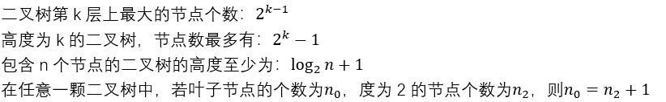
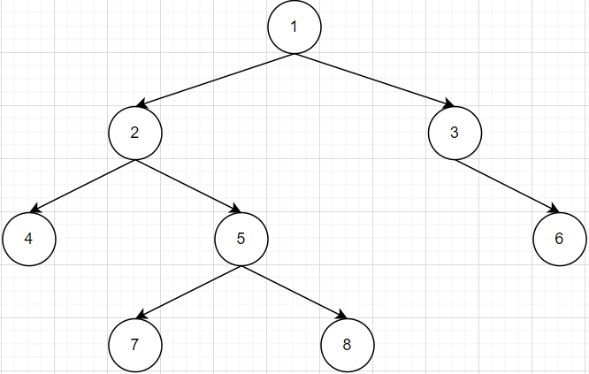
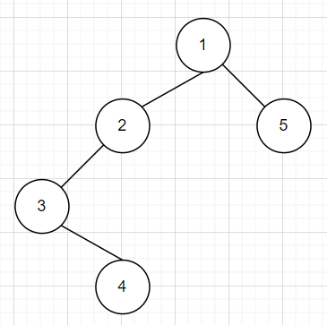

# 数组

静态初始化：int[ ] arr = new int[5];

动态初始化：int[ ] arr = {1,2,3,4,5};

​      int[] arr = new int[ ]{1,2,3,4,5};

内存地址连续；通过下标访问，速度快性能高；增加、删除性能消耗，涉及内存扩容、删除后元素前移。

应用：查找频率高、数据添加删除少

# 链表

线性的顺序存储结构，内存地址不连续，每个节点内存有指向的指针

查询速度较慢，添加、删除较快

- 链表反转

  头插法和原地反转

- 环形链表

  快慢指针法和Set集重判断

# 数

有0个或多个节点的有限集。

叶子节点：有0个子节点的节点

节点的度：子节点的个数

节点的层次：根节点在第一层，依次第二层、第三层……

节点的深度：从根节点到当前节点的唯一路径上的节点总数

节点的高度：从当前节点到最远叶子节点的路径上的节点总数

树的深度：最大的层次数，即所有节点深度的最大值

树的高度：所有节点高度的最大值

树的高度==深度

## 二叉树

### 性质



树中每个节点最多有两个子节点。左子树、右子树有顺序，次序不可颠倒。

满二叉树：所有的叶子节点在同一层，非叶子节点拥有左右子树。

左斜树/右斜树：所有的节点都向一个方向倾斜，只分叉出左/右子树。<-->列表

完全二叉树：高度为h的树，h-1层为满二叉树，第h层都在左侧排列，空位都在右侧。

对完全二叉树的节点进行编号，对于编号为w的节点，则：

​      该节点的父节点为：

​      对于子节点，先有左孩子节点w*2，再有右孩子节点w*2+1 

满二叉树一定是完全二叉树，反之不成立。

### 遍历算法

以下述二叉树为例：



深度优先遍历Deepth First Search

中序遍历    4，2，7，5，8，1，3，6

先序遍历    1，2，4，5，7，8，3，6

后续遍历    4，7，8，5，2，6，3，1

​    

广度优先遍历Breath First Search

按层次遍历  1，2，3，4，5，6，7，8

#### 定义节点信息

```java
class TreeNode<T> {
	T val;
	TreeNode left;
	TreeNode right;
	TreeNode(T val) {
		this.val = val;
	}
}
```

#### 遍历二叉树

```java
/** 前序遍历：根、左、右节点 */
public ArrayList preorder(TreeNode root) {
   // 存放二叉树前序遍历节点值
   ArrayList<Integer> res = new ArrayList<Integer>();
   // 存放节点
   Stack<TreeNode> stack = new Stack<TreeNode>();
   TreeNode node = root;
   while (node != null || !stack.empty()) {
      // 进栈
      while (node != null) {
         res.add((Integer)node.val);
         stack.push(node);
         node = node.left;
      }
      // 出栈
      if (!stack.empty()) {
         node = stack.pop();
         node = node.right;
      }
   }
   return res;
}

/** 中序遍历：左、根、右节点 */
public ArrayList inorder(TreeNode root) {
   // 存放二叉树中序遍历节点值
   ArrayList<Integer> res = new ArrayList<Integer>();
   // 存放节点
   Stack<TreeNode> stack = new Stack<TreeNode>();
   TreeNode node = root;
   while (node != null || !stack.empty()) {
      // 进栈
      while (node != null) {
         stack.push(node);
         node = node.left;
      }
      // 出栈
      if (!stack.empty()) {
         node = stack.pop();
         res.add((Integer)node.val);
         node = node.right;
      }
   }
   return res;
}

/** 后序遍历：左、右、根节点 */
public ArrayList postorder(TreeNode root) {
   // 存放二叉树后序遍历节点值
   ArrayList<Integer> res = new ArrayList<Integer>();
   // 存储节点
   Stack<TreeNode> stack = new Stack<TreeNode>();
   // 定义当前节点
   TreeNode curNode = root;
   // 定义前一个节点：出栈的前一个
   TreeNode preNode = null;
   while (curNode != null || !stack.empty()) {
      // 压栈
      while (curNode != null) {
         stack.push(curNode);
         curNode = curNode.left;
      }
      // 出栈 当前节点无右孩子或前一个节点的右孩子为当前节点
      if (!stack.empty()) {
         curNode = stack.pop();
         if (curNode.right == null || preNode== curNode.right) {
            res.add((Integer)curNode.val);
            preNode = curNode;
            curNode = null;
         } else {
            // 不满足条件，重新压栈
            stack.push(curNode);
            curNode = curNode.right;
         }
      }
   }
   return res;
}
/** 层序遍历 */
public ArrayList floororder(TreeNode root) {
   // 按层次存放节点值
   ArrayList<Integer> res = new ArrayList<Integer>();
   // 队列依次存放每层的节点
   Queue<TreeNode> queue = new LinkedList<TreeNode>();
   TreeNode node = root;
   queue.offer(node);
   while (node != null && !queue.isEmpty()) {
      int size = queue.size();
      for (int i = 0; i < size; i++) {
         node = queue.poll();
         res.add((Integer)node.val);
         if (node.left != null) {
            queue.offer(node.left);
         }
         if (node.right != null) {
            queue.offer(node.right);
         }
      }
   }
   return res;
}
```

### 遍历结果推导二叉树



前序遍历（根 左 右）：1，2，3，4，5

中序遍历（左 根 右）：3，4，2，1，5

后序遍历（左 右 根）：4，3，2，5，1

> 只能通过前序和中序或中序和后序唯一确定一颗二叉树，而前序和后序无法确定。

```java
public TreeNode inorderAndPreorder(int[] preorder, int[] inorder) {
   // 递归结束条件
   if (preorder.length == 0 || inorder.length == 0) {
      return null;
   }
   // 在先序遍历结果中找到根节点对应的值rootValue，并创建根节点root
   int rootValue = preorder[0];
   TreeNode root = new TreeNode(rootValue);
   // 找根节点值在中序遍历中的位置，也为根节点左子树节点个数leftSize
   int leftSize = -1;
   for (int i = 0; i < inorder.length; i++) {
      if (rootValue == inorder[i]) {
         leftSize = i;
         break;
      }
   }
   // 根据leftSize在preorder和inorder中分离出root左子树的中序遍历和先序遍历结果
   int[] leftChildPreorder = Arrays.copyOfRange(preorder, 1, leftSize + 1);
   int[] leftChildInorder = Arrays.copyOfRange(inorder, 0, leftSize);
   // 根据左子树的遍历递归得root左子树的根节点，并构建关系
   root.left = inorderAndPreorder(leftChildPreorder, leftChildInorder);
   // 根据leftSize在preorder和inorder中分离出root右子树的中序遍历和先序遍历结果
   int[] rightChildPreorder = Arrays.copyOfRange(preorder, leftSize + 1, preorder.length);
   int[] rightChildInorder = Arrays.copyOfRange(inorder, leftSize + 1, inorder.length);
   // 根据右子树的遍历递归得root右子树的根节点，并构建关系
   root.right = inorderAndPreorder(rightChildPreorder, rightChildInorder);
   return root;
}
```

## 二叉搜索树

Binary Search Tree

又称二叉查找树、二叉排序树。它或为空树，或为具有以下性质的二叉树：

若左子树不为空，则左子树上所有节点的值均小于它的根节点的值，

若右子树不为空，则右子树上所有节点的值均大于它的根节点的值，

左右子树也均为二叉搜索树。

前驱节点：小于该节点的最大节点

后继节点：大于该节点的最小节点

**二叉搜索树没有两个节点值相同的节点**

> 具有列表快速插入、删除，数组的快速查找的优势。

## AVL树

二叉搜索树中，当插入节点时顺序不同，导致向一边倾斜，最坏下，导致斜树，影响查找效率。通过树旋转构造平衡二叉查找树。

本质为二叉搜索树，高度平衡树，数中每个节点的子树高度差不超过1。


# 哈希表

通过==哈希函数==在“桶”中存储和搜索

- 哈希集合 HashSet

  存储非重复值

  - 遍历
    - 增强 for 循环遍历
    - 迭代器 Iterator 遍历

- 哈希映射 HashMap

  存储k-v键值对
  
  - 遍历
  
    - 获取 key ，结果为 Set 集
  
      Set<T\> set =  map.keySet();
  
    - 获取 K-V
  
      Set<Map.Entry<K, V>> set = map.entrySet();
  
      可单独获取 K 或者 V
  
      T key = Map.Entry<K, V>.getKey();
  
      V value = Map.Entry<K, V>.getValue();

## 哈希函数

即为如 y=x%3+1，x为键值，y为桶索引，理想情况下，一个键对应一个桶，键-桶是一对一的关系。

1)、直接寻址法：

  直接取关键字或关键字的某个线性函数作为散列地址

2)、除留取余法：

  对关键字或关键字的部分取模，结果作为散列地址

  取模的除数，一般为素数或质数

3)、取随机数法：

  使用随机函数，取关键字的随机值，作为散列地址

4)、数字分析法：

  根据数字的特性，经过分析，取部分进行计算（手机号后四位、身份证后四位）

5)、平方取中法

  求平方，取中间几位作为散列地址

6)、折叠法

  取关键字的几部分，取叠加和作为散列地址

## 哈希冲突

又称==哈希碰撞==，不同的键值分配到一个桶中

### 解决冲突

寻找另外的空闲位置

1)、线性探测

  如果满了，顺延到下一个位置

2)、二次探测

  如果满了，按照一定规律顺延

3)、双重哈希

  使用两种哈希函数，当第一个位置占用时使用第二个函数

4)、链表法

  让一个位置存储多个value，value用链表串联

# 查找

## 顺序查找

在 数组、链表 等顺序结构中按顺序挨个进行比较判断。

时间复杂度：O(n)

空间复杂度：O(1)

## 二分查找

又称==折半查找==，适于有序的顺序表(元素值有序)。

### 原则

每次查找都缩小查找范围，且不能排除潜在答案 

### 普通查找一个精确值

循环结束条件：left <= right

缩小空间：left = mid + 1, right = mid - 1

mid = (right – left)/2 + left; 

### 查找一个模糊值(首次出现值)

循环结束条件：left < right

缩小空间：left = mid, right = mid - 1            或       left = mid + 1, right = mid

​               mid = left + (right - left + 1)/2 	       mid = left + (right - left)/2

### 查找最接近的值

循环结束条件：left < right - 1

缩小空间：left = mid, right = mid

## 哈希查找


# 排序

> 选择排序、冒泡排序、插入排序时间复杂度均为O(n^2^),但是插入排序相比略优


