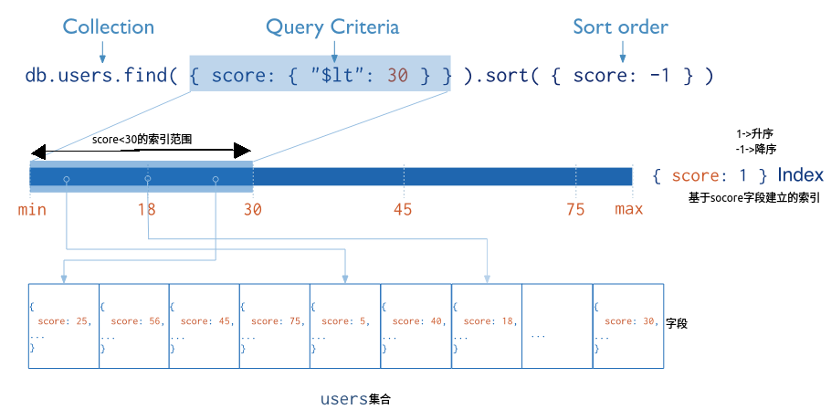
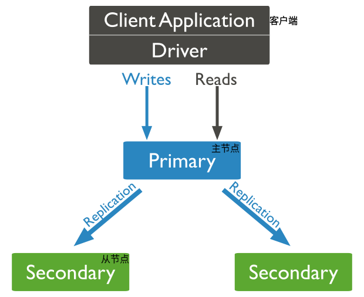

# MySQL

## 引擎

MyISAM和InnoDB

### MyISAM

5版本前，不支持事务，不支持行级锁，只支持表级锁

### InnoDB


# MongoDB

## 简介

MongoDB 是一个==文档数据库==，旨在简化应用程序开发和扩展。

- 它由字段和值(文档、数组)对组成的数据结构；

- 为提供可扩展的高性能数据存储解决方案，介于关系型数据库和非关系型数据库之间，偏向于非关系型；
- 类似于 JSON 格式，可存储复杂的数据类型；
- 支持对数据建立索引。

## 特点

MongoDB 将文档存储在==集合==中，集合类似于关系数据库中的表；

- 高性能
- 查询接口
- 高可用性
- 水平可扩展性
- 支持多个存储引擎

## 应用

游戏：存储用户信息，如装备、积分等

物流：存储订单信息，如状态

社交：存储用户信息，如地理位置中附近的人、朋友圈、聊天记录

直播：存储用户信息、礼物等

大数据：数据分析

## 准备

- 开启 mongod 服务

  `systemctl start mongod`

- 本地连接 MongoDB

  `mongosh`

  > 每次连接 MongoDB，都会进入 `test` 数据库
  
- 远程服务器连接 MongoDB

  `mongosh --host 主机 --port 27017`

## 数据库和集合

### 概述

MongoDB 将数据记录存储为文档(BSON)，将这些文档一起聚集在集合中。一个数据库存储一个或多个文档集合。默认的数据库为“test”。

### 数据库

数据库存储一个或多个文档集合。

- 查看库

  `show databases`  或 `show dbs`

  > 默认有 admin 、config 、local 三个保留库

- 创建库

  `use 数据库`

  > 创建后，切换至“db”数据库，但此时库中没有任何的集合数据，默认不进行显示(“查看库”时没有该库)

- 切换库

  `use 数据库`

- 查看当前库

  `db`

- 删除库

  `db.dropDatabase()`

  > `db` 为当前库
  >
  > 删除后，当前库中没有集合数据，显示当前库是“删除的库”，查看所有库时没有显示。

### 集合

MongoDB 将文档存储在集合中，集合类似于关系数据库中的表。

- 查看集合

  `show tables` 或 `show collections`

- 创建集合

  `db.createCollection("集合名")` 创建了一个 users 集合

- 删除集合

  `db.集合名.drop()` 

  users 为集合名称

### 文档

文档是集合中的一条一条的记录，是一组键-值对；单个集合中的文档不需要具有相同的字段集，且字段的数据类型可以在集合中的文档间有所不同。

#### 插入

> 如果该集合当前不存在，插入操作将会创建该集合。
>
> 如果文档没有指明一个 `_id` 字段(唯一标识每个文档)，MongoDB 将会自动添加一个 ObjectId 类的 `_id` 值到新创建的文档中

- 单条文档

  `db.集合.insertOne({k1: 'v1', k2: 'v2'})` 或 `db.集合.insert({k1: 'v1', k2: 'v2'})`

- 多条文档

  `db.集合.insertMany([{k1: 'v1', k2: 'v2'}, {K1: 'V1', K2: 'V2', _id: 123}])` 或

  `db.集合.insert([{k1: 'v1', k2: 'v2'}, {K1: 'V1', K2: 'V2', _id: 123}])` 

#### 查询

`find({条件}, {投影查询})`

> 投影查询：返回的字段值
>
> 条件 : $lt	$lte
>
> ​	       $gt	$gte
>
> ​			 $ne

`find().pretty()` -> 输出的文本进行格式化

- 查询所有

  `db.集合.find()` 
  
- 等值查询

  `db.集合.find({k: 'v'})`

- 大于、小于、大于等于、小于等于、不等于查询

  `db.集合.find({k1: {$条件: v1}, k2: v2})`

  > `{k1: {$条件: v1}, k2: v2}` 中 ==,== 相当于 & 且 条件，但是当条件中对同一个字段进行匹配时，则以最后一个为准，如 "db.users.find({name: 'zhangsan', name: 'lisi'})"，则结果中只有name为lisi的信息

- or 条件查询

  `db.集合.find({$or: [{条件}, {条件}])` 

- or 和 and 结合查询

  `db.集合.find({k1: v1, $or: [{条件}, {条件}]})` 
  
- 模糊查询

  > 使用正则表达式查询

  `db.集合.find({k: /v/})` 

- 数组元素个数条件查询

  `db.集合.find({k: {$size: 个数}})`

- 查询结果排序

  `db.集合.find().sort({k1: v1, k2: v2})`

  > v 为 1 时，以 k 升序；v 为 -1 时，以 k 降序

- 查询结果分页

  `db.集合.find().skip(m).limit(n)`

  > 表示集合中的所有数据都查询出来，显示第 m 页，一页有 n 条文档记录

- 查询结果文档记录条数

  `db.集合.find().count()`

- 查询结果去重

  `db.集合.distinct('k')`

- 查询结果返回指定的字段

  `db.集合.find({条件}, {k1: 1, k2: 0})`

  > 0 : 不返回该字段的信息
  >
  > 1 : 返回该字段的信息
  >
  > 其中 _id 字段是默认返回，这里只能设置 _id: 0，其余字段为 1

#### 更新

`db.集合.update({条件}, {$set: {v1: k1, v2: k2}}, option)` 或

`db.集合.updateOne({条件}, {$set: {v1: k1, v2: k2}})`  或

`db.集合.updateMany({条件}, {$set: {v1: k1, v2: k2}})` 

> 若更新的字段不存在，则添加该字段的信息
>
> <a id="size"></a>
>
> `$set`运算符 : 将字段值替换为指定值 `{$set: {k1: v1, ...}}`
>
> `option` 选项 :
>
> ​				 `multi: boolean` : 为 true -> 更新满足条件的多个文档
>
> ​													   为 false -> 更新一个文档，也为默认值

#### 删除

- 删除所有

  `db.集合.remove({})` 或 `db.集合.deleteMany({})` 

- 按条件删除记录

  `db.集合.deleteOne({条件})` 或

  `db.集合.remove({条件})` 或

  `db.集合.deleteMany({条件})` 

  > deleteOne 只能删除一条文档记录
  >
  > deleteMany 和 remove 可删除一条或多条文档记录

## 聚合

集合操作处理多个文档并且返回计算结果。可以：

- 将对个文档的值一起分组
- 在组数据执行操作从而返回单条数据
- 分析随时间变化的数据

`db.集合.aggregate([{$group: {_id: '$name', 'name_count': {$sum: 1}}}])`

> $name : 表示取文档中 name 字段的值；
>
> 以集合中的name字段进行分组，并且计算每个组中文档的数量。

有关上述运算符的说明：

[$group](#group)

[$sum](#sum)

## 索引

索引是为了高效的查询，查询时不必要进行全部文档集合的扫描。索引是特殊的数据结构，以一个易于遍历的形式存储在集合中的一小部分。索引存储特殊的字段值或字符集的值，并通过字段进行排序。索引的排序支持高效的相等匹配和基于范围的查询操作。另外，MongoDB 通过使用索引排序返回排序结果。



### _id 索引

MongoDB 在创建集合期间会创建一个唯一的索引在"\_id"字段上。"\_id"索引阻止用户在同一个集合中插入两个"\_id"字段值相等的文档记录。你不能删除"_id"字段的索引。

### 索引操作

- 创建索引

  `db.集合.createIndex({字段: 升降序}, option)`

  eg: `db.users.createIndex({name: 1}, {name: 'name_index', expireAfterSeconds: 30})`

  > option
  >
  > background: boolean	默认为 false，为 true 时指示 MongoDB 在后台构建索引
  >
  > unique: boolean	默认为 false，索引是否唯一
  >
  > name: 指定索引的名字
  >
  > sparse: boolean	默认为 false，索引仅对存在该字段的文档有效，在检索时不会被查询
  >
  > expireAfterSeconds: 指定一个以秒为单位的“生存时间(TTL)”，来设定索引在集合的生存时间
  >
  > v: 索引的版本号

- 查询索引名称

  `db.集合.getIndexes()`

  > 字段"\_id" 的索引名称为 "\_id_" 
  >
  > 普通字段的索引名称默认为 "字段_升降序"

- 删除索引

  `db.集合.dropIndexes()` 或

  `db.集合.dropIndex("indexName")`

  > 删除索引不包括：_id
  >
  > dropIndexes() : 删除所有索引
  >
  > dropIndex("index_name") : 删除指定索引

- 查询索引大小

  `db.集合.totalIndexSize()`

### 类型

#### 复合索引

用户定义的多个字段的索引，即该索引值是由这几个字段共同维护的。

- 创建

  `db.集合.createIndex({字段1: 升降序, 字段2: 升降序...})`

  > 符合索引的名称为：字段1\_升降序\_字段2_升降序...
  >
  > MongoDB 遵循 ==左前缀原则==
  >
  > 当查询的顺序不同时，引擎会自动调整字段的顺

## 副本集

### 介绍

MongoDB 中的 ==副本集== 是一组 mongod 维护相同数据集的进程。副本集提供冗余和[高可用性](#high availability)，并且是所有生产部署的基础。

一个副本集包含多个数据承载点和一个可选的仲裁点。在数据承载点中，有且仅有一个成员是主节点，其他节点是从节点。



> 客户端始终对主节点进行读写操作，当主节点发生变化时，从节点会进行更新，保证主从节点的数据一致。

<a id="high availability"></a>

**高可用** 

高可用性表明系统设计是为了耐久性、冗余性和自动故障切换/转移的，便于系统支持的应用能够长时间连续运行，不会长时间停机。

> 故障转移：在主节点发生故障时(主节点与其他节点的通信超过了配置期限)，符合条件的多个从节点通过“心跳”进行选举(从节点自荐)，选出一个作为主节点提供服务。

> 当副本集中只有一个从节点时，从节点不能充当主节点对系统提供服务了。

### 搭建

`mongod --port 端口 --dbpath 数据目录 --bind_ip 0.0.0.0 --replSet 副本集名/[地址:端口,地址:端口]`

连接 MongoDB ，配置副本集

**初始化**

```sql
admin> var config = {
 	_id: "myReplace",
	members: [
		{_id: 0, host: "localhost:27017"},
		{_id: 1, host: "localhost:27018"},
		{_id: 2, host: "localhost:27019"}
    ]
};

rs.initiate(config);
```

### 限制

副本集的可进行自动故障转移，解决了数据的冗余备份和高可用性。

但是在数据量特大时无法解决硬件的容量限制和高并发压力的问题，出现了 ==分片== 处理

## 分片

分片是一种跨多台机器分布数据的方法(将数据分散在不同的机器)，可支持大数据集和高吞吐量操作的部署。

分片是一种水平扩展，在多台服务器上加载数据，通过添加服务器来增加资源。

> 垂直扩展：增加单个服务器的容量，但是工作负载具有一个实际的限制。


## 运算符

### [$set](#size)

### $size

计算并返回数组中的元素个数。

### $type

返回一个符合 BSON 参数类型字符串对应值的文档记录，如 double-1、string-2、object-3、array-4、binData(Binary data)-5、objectId-7、bool-8、date-9、null-10、regex-11、javascript-12、int(32-bit integer)-16、timestamp-17、long(64-bit integer)-18、decimal(Decimal128)-19、minKey(Min key -1)- -1、maxKey(Max key 127)-127

`db.集合.find({k: {$type: val}})` - `db.集合.find({k: {$type: 1}})` 或

`db.集合.find({k: {$type: 'type'}})` - `db.集合.find({k: {$type: 'double'}})`

> 返回集合中 k 的值类型为 double(1) 的文档记录

### $match

应用于聚合操作中，过滤文档且将匹配条件的文档传递到下一个管道阶段。

`{$match: {condition}}` 

### $group<a id="group"></a>

应用于聚合操作中，该阶段通过一个“组键”将文档记录分离成组。输出每个唯一“组键”的一个文档。

`db.集合.aggregate([{$group: {_id: '$字段'}}])` 

> 组键名 : _id
>
> '$字段' : 为获取文档记录中该字段的值
>
> 上述表示：以“字段”进行分组，且该字段值为“组键”


### $sum<a id="sum"></a>

应用于聚合操作中，计算并返回数值的总和。

`{$sum: 操作数}` 

> 当操作数为一个数值时，返回结果为 计算结果*操作数

## SpringBoot 整合

- 添加依赖 `spring-boot-starter-data-mongodb` 

- 配置数据库

  ```yml
  spring:
    data:
      mongodb:
        uri: mongodb://localhost:27017/数据库名
  ```

> 添加依赖、配置过后，Spring Boot 工厂会创建一个 `MongoTemplate` 对象， 来帮助我们操作 MongoDB。

- 注解

  - `@Document(collection = "")`

    作用于类上

    将该类的实例作为 MongoDB 的一条文档数据

    collection 为指定存放文档记录的集合

  - `@Id`

    作用于成员变量、方法上

    将该属性与 MongoDB 文档记录的 _id 进行映射

  - `Field(name = "")`

    作用于成员变量、方法上

    将该属性与 MongoDB 文档记录的 K 进行映射

    name 为指定文档的字段名

  - `Transient`

    作用于成员变量、方法上

    该字段在转换为文档记录时不参与序列化

- MongoDB 操作

  - 集合操作

    - 创建

      `mongoTemplate.createCollection(集合名称)`

      创建已存在的集合会发生错误，需要检查该集合是否存在

      `mongoTemplate.collectionExists(集合名称)`

    - 删除

      `mongoTemplate.dropCollection(集合名称)`

      即也可以删除不存在的集合

  - 文档操作

    - 添加

      `mongoTemplate.save(保存的对象)` 或

      `mongoTemplate.insert(保存对象的集合, 实体类)` 

      > save 和 insert 都可用来添加集合，主要区别：
      >
      > save:
      >
      > ​	      一次保存单条文档记录
      >
      > ​		  save 无论 _id 是否存在，都会存入，当 _id 存在时，会将记录删除后在存入
      >
      > insert:
      >
      > ​          一次可保存多条记录
      >
      > ​			当 _id 存在时，阻止存入(报错)

    - 查询

      - 查询所有
    
        `mongoTemplate.findAll()`
    
        `mongoTemplate.findAll(new Query(), 实体类)` 
    
        > `Query` 是 MongoDB 的查询对象，表示条件、投影、排序和查询提示。
        >
        > 其中可用于分页、排序。
    
      - _id 查询
    
        `mongoTemplate.findById(id值, 实体类)`
    
      - 等值查询
    
        `mongoTemplate.find(Query.query(Criteria.where().is()), 实体类);`
    
        > `Criteria` 是创建查询的中心类。他对应许多 MongoDB API 的查询条件运算符，如类中的方法：
        >
        > ne --> $ne
        >
        > lt --> $lt
        >
        > size --> $size
        >
        > type --> $type
        >
        > orOperator() --> $or
        >
        > 等等，许多是可以见名生意的
    
      - and 查询
    
        `mongoTemplate.find(Query.query(Criteria.where().is().and().lt()), 实体类);`
    
        > 表示查询当 **某个字段等于某值** 且 **某个字段小于某值** 时的查询结果
    
      - or 查询
    
        ```java
        mongoTemplate.find(
            Query.query(new Criteria().orOperator(多个Criteria.where()条件),
            实体类
        );
        ```
    
    - 更新
    
      - `updateFirst` 
    
        ```java
        Update update = new Update();
        update.set(K, V);
        mongoTemplate.updateFirst(Query.query(Criteria.where().is()), update, 实体类);
        ```
    
        > 更新符合查询条件的第一条记录	
    
      - `updateMulti`
    
        ```java
        update = new Update();
        update.set(K, V);       mongoTemplate.updateMulti(Query.query(Criteria.where().is()), update, 实体类);
        ```
    
        > 将条件查询到的结果全部更新
    
      - `upsert`
    
        ```java
        update = new Update();
        update.set(K, V);
        mongoTemplate.upsert(Query.query(Criteria.where().is()), update, 实体类);
        ```
    
        > 当条件查询无符合记录时，插入更新的数据值记录
    
    - 删除
    
      `mongoTemplate.remove(Query, 实体类)` 


