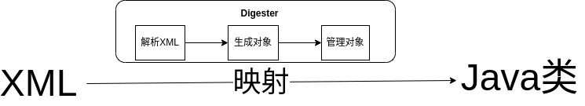

# Tomcat

## 目录结构

- bin

  一些脚本文件，包括 Tomcat 的启动脚本和关闭脚本

  > startup、shutdown，执行启动脚本时会执行 catalina 脚本，而 [Bootstrap](#bootstrap) 类作为 Tomcat 的启动类

- conf

  一些配置文件，如 server.xml

- webapps

  web 项目

- java

- modules

  含有 Apache Tomcat JDBC Pool

- res

- test

## Server.xml

### 结构

### 解析

`Digester`

> 许多项目读取 XML 配置文件去提供各种 Java 对象的初始化。有几种方式可以做到，且 Digester 组件在许多项目中被公共的设计使用。
>
> 基本上，DIgester 让你配置 XML ---> Java 映射模块，当识别出 XML 中的元素时，该模块就触发相应的操作规则。许多预定义的规则对你是可用的，或者你也能自己创建。

### 详述

#### Server

是一个 Catalina 容器

#### Service

是共享 Container 的 Connector

#### Container

处理请求和返回相应的一个对象。独立于 Server 和 Service，拥有以下子容器，包含着其他组件。

- Host

  Catalina servlet 引擎中的虚拟主机。一个虚拟主机包含多个 Context。

- Context

  servlet 上下文(web 应用)，Catalina servlet 引擎中的一个单独的 web 应用。

- Engine

  整个 Catalina servlet 引擎，子容器 Host 和 Context 附属于 Engine。 

- Wrapper

## Bootstrap

